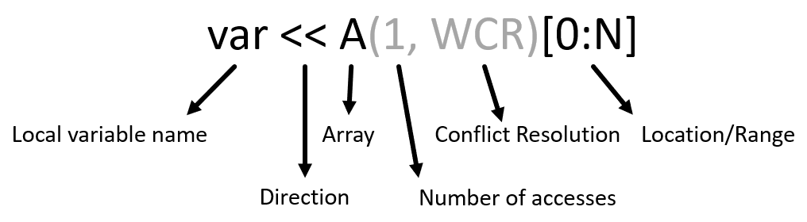

Writing DaCe Programs in Python
===============================

The entry point to DaCe is ``dace.program`` (aliases ``dace``, ``dace.function``). It is a function that wraps around
an existing Python function or method for parsing.

We support a large subset of the Python language, geared towards scientific computing and high-performance applications.
This includes standard Python code (loops, functions, context managers, etc.), but also native support for NumPy arrays
and (most) functions. 

.. note::
    For more examples, see the `Getting Started <https://nbviewer.org/github/spcl/dace/blob/master/tutorials/getting_started.ipynb>`_
    Jupyter Notebook tutorial.

Usage
-----

You can use :func:`~dace.frontend.python.interface.program` either as a decorator or a wrapper:

.. code-block:: python

    import dace

    @dace.program
    def myfunction(a, b):
        return a + b

    def other_function(c, d):
        return c * d + myfunction(c, d)

    dfunc = dace.program(other_function)

    # Calling ``myfunction`` or ``dfunc`` will trigger DaCe compilation

The Python frontend will then try to parse the entire function, including internal function calls, so you only need to
annotate the top-level function. What it can parse is converted to our :ref:`data-centric intermediate representation <sdfg>`, 
and what it cannot parse will be encapsulated (best-effort) as callbacks to the Python interpreter. Callbacks are useful
because they allow programs to use the full power of the Python ecosystem. For example, if you wish to read a file, 
compute something expensive and plot the result during computation, you can!

.. code-block:: python

    import dace
    import seaborn as sns  # For plotting
    import matplotlib.pyplot as plt

    @dace.program
    def expensive_computation(inputs: dace.float64[N, M, K]):
        ...
        for i in range(iterations):
            ...
            sns.histplot(intermediate_result)
            plt.show()
            ...
        ...

A warning is issued for any such unintended callback, just in case you wanted to compile that function too.

If you are using classes, methods need to use the ``@dace.method`` decorator (due to how Python function binding works).
Fields and globals work directly in the Python frontend:

.. code-block:: python

    import numpy as np

    class MyClass:
        def __init__(self, x, y):
            self.x = x
            self.y = y

        @dace.method
        def method(self, z):
            return self.x * (self.y + z)

    a = np.random.rand(20)
    b = np.random.rand(20)
    obj = MyClass(2, a)
    c = obj.method(b)
    assert np.allclose(c, 2 * (a + b))

Parallelization Hints
---------------------

To ease performance programming and give users control over parallelism, we extend Python with additional iterators and
functions. Note that outside of a ``@dace.program``, these constructs will run sequentially with the Python interpreter
and can be directly debugged.

The first generator is the multidimensional :class:`~dace.frontend.python.interface.map` construct (see the 
:ref:`IR <sdfg-map>` for a definition), which enables parallel iteration over arbitrary ranges::

    for i, j in dace.map[0:N, 0:M]:
        a[i, j] = b[j, i]

Another form of iteration is the dynamic producer/consumer construct :class:`~dace.frontend.python.interface.consume`:

.. code-block:: python

    for value in dace.consume(S, 4):  # 4-threaded consumption of stream ``S``
        print(value)

.. _jit_aot:

Ahead-Of-Time vs. Just-In-Time Compilation
------------------------------------------

As DaCe is designed to work with large-scale applications, or programs that take a long time to build (for example, FPGA),
we support two modes of operation: compiling Python code once (Ahead-Of-Time, or AOT), and compiling it every time it is
called with a new set of argument types (Just-In-Time, or JIT).

In general, AOT compilation is always preferable over JIT: the types are clear, there are no unexpected slowdowns due
to compilation, and the compiled library can be used outside of Python (for example, linked against a C or FORTRAN executable).
Since Python is a dynamically-typed language, to support AOT compilation we need to provide **type hints** on the function's
arguments.

As opposed to other frameworks, we can use AOT compilation *even if the sizes of the arrays are not known in advance*.
SDFGs are parametric, so you can use symbols to avoid recompilation for every size. DaCe has a powerful symbolic
engine (powered by `SymPy <https://www.sympy.org>`_) that can perform checks and analysis natively. For example,
it can raise issues if the wrong sizes are used in an operation:

.. code-block:: python
    
    @dace.program
    def func(A: dace.float64[N, K], B: dace.float64[M, K]):
        C = A @ B    # NOT OK - will raise "DaceSyntaxError: Matrix dimension mismatch K != M"
        C = A @ B.T  # OK
        ...

The type hint objects we use are called :ref:`Data Descriptors <descriptors>`, and they provide all the information
necessary to allocate and track the memory of a data container. You can create scalars by using typeclasses, for example
``dace.float32``, and use the shorthand ``typeclass[dimensions...]``, as
can be seen in the above example, for multidimensional arrays. As type hints are flexible, you can also construct them
in advance and use them:

.. code-block:: python

    from typing import Optional

    Aliased = dace.data.Array(dace.float64, [20, N], may_alias=True)
    # ...
    @dace
    def func(x: Aliased, y: Optional[Aliased] = None):
        ...

Only if all types are provided, programs can be compiled and/or transformed as an SDFG. Otherwise, example (or the actual)
inputs have to be provided in order for parsing to work:

.. code-block:: python

    import dace
    import numpy as np

    @dace.program
    def annotated(a: dace.float64[20, 10], b: dace.int32):
        ...

    sdfg = annotated.to_sdfg()  # OK

    @dace.program
    def partially_annotated(a, b: dace.int32):
        ...

    sdfg = partially_annotated.to_sdfg()  # NOT OK - SyntaxError exception "missing argument: 'a'"

    sample_input = np.random.rand(20, 10)
    sdfg = partially_annotated.to_sdfg(sample_input)  # OK

Annotating Storage and Schedule
~~~~~~~~~~~~~~~~~~~~~~~~~~~~~~~

It is also possible to annotate the storage location of an array or where a map will run directly using the ``@`` operator:

.. code-block:: python

    from dace.dtypes import StorageType, ScheduleType
    import cupy

    @dace
    def runs_on_gpu(a: dace.float64[20] @ StorageType.GPU_Global, 
                    b: dace.float64[20] @ StorageType.GPU_Global):
        # This map will become a GPU kernel
        for i in dace.map[0:20] @ ScheduleType.GPU_Device:
            b[i] = a[i] + 1.0

    gpu_a = cupy.random.rand(20)
    gpu_b = cupy.random.rand(20)
    runs_on_gpu(gpu_a, gpu_b)

Symbols
~~~~~~~

Symbols are useful for many parametric analyses, for example, when creating size-independent programs as mentioned above.
Internally, DaCe uses symbolic expressions for sizes, ranges, data movement subsets, and more.

Defining a :class:`~dace.symbolic.symbol` in the Python frontend is straightforward:

.. code-block:: python

    N = dace.symbol('N')

Symbols can then be used anywhere in DaCe programs:

.. code-block:: python

    @dace.program
    def func(x: dace.float32[N + 1, 2 * N]):
        x[:] = N
        return x[:N, N:]  # Return type will be inferred as dace.float32[N, N]

Symbol values can only be modified when a program is called, or upon an SDFG state transition. In the Python frontend,
the symbolic sizes of an array do not have to be specified --- the symbolic engine solves a system of equations to determine
that on its own. Calling ``func`` above with a 13x24 array would infer ``N = 12`` automatically. Symbols that do not
have hints have to be given explicitly, as keyword arguments. For example:

.. code-block:: python

    T = dace.symbol('T')

    @dace.program
    def func2(x: dace.float64[20]):
        for i in range(T):
            x += i

    # Even though T is not an explicit parameter, it is implicitly required by DaCe
    func2(x, T=2)

Typeclasses
~~~~~~~~~~~

.. _typeclasses:

The typeclasses that can be used as element types for data containers are versatile, and can be used for performance
and compatibility with other codes:

    * Base types such as :pycode:`dace.uint8` (see :class:`~dace.dtypes.Typeclasses` for a full list)
    * Native :class:`~dace.dtypes.vector` types (vectors of vectors also supported)

        * Example: :pycode:`dace.vector(dtype, vector_length)`
    
    * Compound :class:`~dace.dtypes.struct` types

        * Example: :pycode:`dace.struct(x=dace.float64, y=dace.float64, mass=dace.float16)`
    
    * Callbacks to native code via :class:`~dace.dtypes.callback`
    
        * Example: :pycode:`dace.callback(return_type, *arg_types)`
    
    * Interoperability with libraries via the :class:`~dace.dtypes.pointer` and :class:`~dace.dtypes.opaque` types

        * Example: :pycode:`dace.pointer(dace.opaque('MPI_Request'))`

Closure (arguments, fields, and globals)
~~~~~~~~~~~~~~~~~~~~~~~~~~~~~~~~~~~~~~~~

Python functions can also use variables defined out of their scope. Those (among other things) define the *closure* of the function.
DaCe natively supports closures, and works differently depending on the type of external variable used. Once the function
is compiled, **scalars and constants are assumed to be compile-time constants**, whereas arrays are given to the function 
as implicit arguments. This emulates the natural behavior of Python functions and their interaction with globals (which 
is read-only unless the ``global`` or ``nonlocal`` keywords are used).

The following example demonstrates how it all works together:

.. code-block:: python

    import dace
    import numpy as np

    a = np.zeros((20,))
    b = 5

    @dace.program
    def closures():
        a += b

    closures()  # Neither ``a`` nor ``b`` are given as arguments
    print(a)    # Prints [5., 5., ..., 5.]
    b = 10
    closures()
    print(a)    # Prints [15., 15., ..., 15.]

    # Check SDFG for data containers
    sdfg = closures.to_sdfg()
    print(sdfg.arrays)  # Prints {'__g_a': Array (dtype=double, shape=(20,))}

    a[:] = 1
    b = 100
    sdfg(__g_a=a)
    print(a)
    # Prints [11., 11., ..., 11.], because ``a`` is an array and 
    # ``b`` is treated as a compile-time constant

Compile-Time Arguments
~~~~~~~~~~~~~~~~~~~~~~

Certain arguments can be specified as compile-time constants using the ``dace.compiletime`` type annotation.
This is useful for two reasons:

    * Inlining a constant value into a function for compiler optimization
    * Telling the DaCe framework to not try to create a data container for an input argument, but to treat it
      as part of the closure of the function

In Just-In-Time (JIT) compilation, compile-time argument annotation does not matter, as all types and values are resolved
during compilation. However, in AOT mode it is necessary.

An example use of :class:`~dace.dtypes.compiletime` for the second aforementioned reason is carrying over a state object,
a pattern that is common in scientific computing applications:

.. code-block:: python

    class PhysicsState:
        """ A class that keeps many fields relating to some system state. """
        dt: float
        positions: dace.float64[N]
        # ...

    @dace.program
    def simulate(state: dace.compiletime):
        # State can be passed along to nested functions
        substep(state, other_arguments, ...)

        # Its fields are used as data containers
        state.positions += forces(state.dt)
        

A commonly recurring example of compile-time arguments is in object-oriented programming. ``self`` in DaCe methods is
always considered a compile-time argument, which allows the fields of the object to be given and used as part of the
closure.

.. _explicit-dataflow-mode:

Explicit Dataflow Mode
----------------------

.. warning::
    This mode provides a low-level syntax for fine-grained control of the generated SDFG, use sparingly as it can 
    disrupt optimizations (e.g., if the tasklets are too large).

The DaCe Python frontend allows users to write SDFG tasklets and memlets directly in Python code.
For more example uses, see the `Explicit Dataflow <https://nbviewer.org/github/spcl/dace/blob/master/tutorials/explicit.ipynb>`_
tutorial.

Memlets
~~~~~~~

:ref:`sdfg-memlet` are a unit of data movement. We can explicitly define them in Python code using a shift operator 
between a local variable (left-hand side) and an array, or between two arbitrary arrays. The full syntax is as follows
(gray elements are optional):

Tasklets
~~~~~~~~

To create a :ref:`Tasklet <sdfg-lang>`, use the :class:`~dace.frontend.python.interface.tasklet` Python context manager::

    with dace.tasklet:
        # Input memlets
        a << A(1)[i, :]  # A is accessed once, but at an arbitrary column

        # Tasklet contents
        b = a[j]

        # Output memlets
        b >> B[i]

Tasklets can contain arbitrary (albeit limited) Python code, and must not access any memory outside the set of memlets
given to it.

The order of memlets in a tasklet does not matter, and they can be placed before or after the contents.
Tasklets accept an argument specifying their language, which means you can specify, e.g., C++ code directly, as follows::

    with dace.tasklet(dace.Language.CPP):
        inp_arr << A          # Will create a pointer
        inp_scal << B[i, j]   # Will create a scalar
        out >> C[i, :]        # Will create an offsetted pointer
        # Tasklet contents are written as a string
        """
        // Symbols can be used normally within the tasklet
        out[j] = *((float *)inp_arr) * inp_scal;
        """

Example
~~~~~~~

The below example combines the two above features to write the classical matrix multiplication, using a map, a tasklet,
and a write-conflicted memlet:

.. code-block:: python

    @dace.program
    def matmul_wcr(A: dace.float32[M, K], B: dace.float32[K, N], C: dace.float32[M, N]):
        # Iterate in a single map over all ranges
        for i, j, k in dace.map[0:M, 0:N, 0:K]:
            # Define a (Python) tasklet
            with dace.tasklet:
                a << A[i, k]
                b << B[k, j]

                c = a * b  # We store the multiplication in c, which triggers an
                           # addition due to conflict resolution
                
                # One output, at index "i,j", write-conflict resolution is summation
                c >> C(1, lambda a, b: a + b)[i, j]

.. _calling_sdfgs:

Calling SDFGs Directly
----------------------

If you want to call SDFGs from a ``@dace.program`` you can do so directly. This is useful when you have a custom implementation
or when you want to use another frontend (for example, in a :ref:`domain-specific language <dsl>`). Example:

.. code-block:: python

    import dace

    mysdfg = dace.SDFG(...)
    # ...

    @dace.program
    def function(a, b, c):
        mysdfg(A=a, B=c)

Note that keyword arguments do not have to be used if the :attr:`~dace.sdfg.sdfg.SDFG.arg_names` property of the SDFG is
set correctly.
