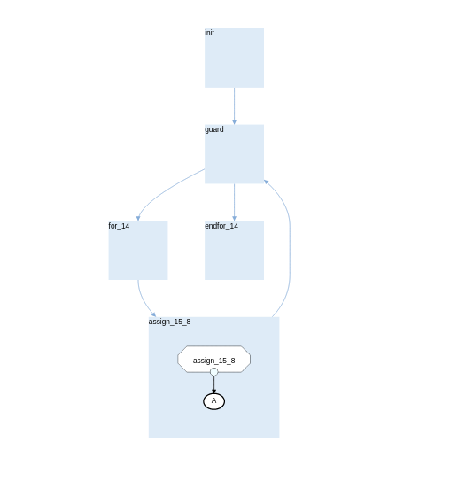
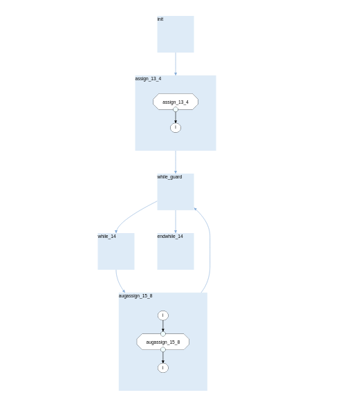
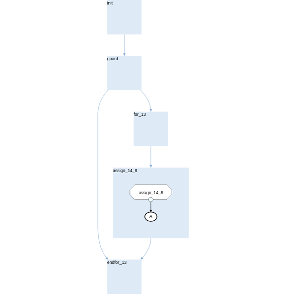
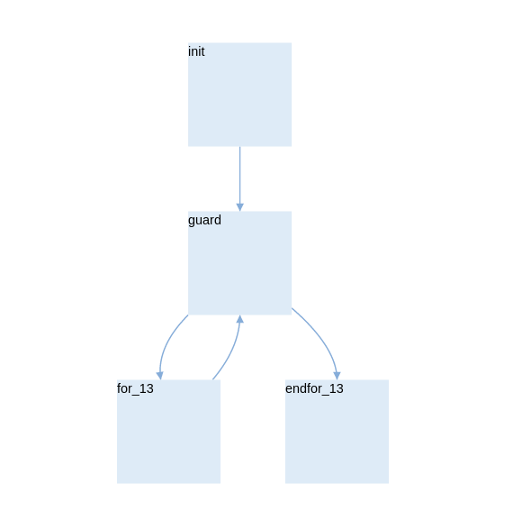
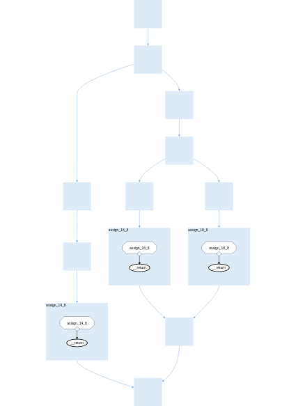
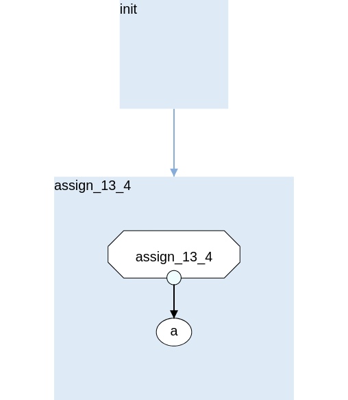
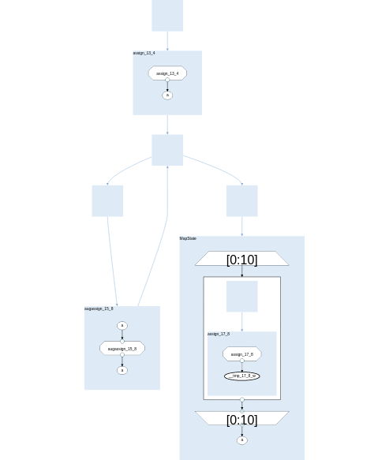

Parsing Python Programs to SDFGs
================================

Prerequisites
-------------

- :doc:`daceprograms`

Scope
-----

This document describes DaCe's core Python language parser, implemented by the :class:`~dace.frontend.python.newast.ProgramVisitor` class.
The :class:`~dace.frontend.python.newast.ProgramVisitor` supports a restricted subset of Python's features that can be expressed directly as SDFG elements.
A larger subset of the Python language is supported either through code preprocessing (see :doc:`preprocessing`) and/or in JIT mode (see :doc:`jitoop`).

Supported Python Versions
-------------------------

The :class:`~dace.frontend.python.newast.ProgramVisitor` supports exactly the same Python versions as the Data-Centric framework overall: 3.7-3.10.
To add support for newer Python versions, the developer should amend the :class:`~dace.frontend.python.newast.ProgramVisitor`
to handle appropriately any changes to the Python AST (Abstract Syntax Tree) module. More details can be found in the
official `Python documentation <https://docs.python.org/3/library/ast.html>`_.

Main Limitations
----------------

- Classes and object-oriented programing are only supported in JIT mode (see :doc:`jitoop`).
- Python native containers (tuples, lists, sets, and dictionaries) are not supported **directly** as :class:`~dace.data.Data`. Specific instances of them may be **indirectly** supported through code preprocessing (see :doc:`preprocessing`). There is also limited support for specific uses, e.g., as arguments to some methods.
- Only the `range <https://docs.python.org/3/library/stdtypes.html#range>`_, :func:`parrange`, and :func:`~dace.frontend.python.interface.map` iterators are **directly** supported. Other iterators, e.g., `zip <https://docs.python.org/3/library/functions.html#zip>`_ may be **indirectly** supported through code preprocessing (see :doc:`preprocessing`).
- Recursion is not supported.

Parsing Flow
------------

The entry point for parsing a Python program with the :class:`~dace.frontend.python.newast.ProgramVisitor` is the :func:`~dace.frontend.python.newast.parse_dace_program` method.
The Python call tree when calling or compiling a Data-Centric Python program is as follows:

1. :class:`dace.frontend.python.parser.DaceProgram`
2. :func:`dace.frontend.python.parser.DaceProgram.__call__`, or :func:`dace.frontend.python.parser.DaceProgram.compile`, or :func:`dace.frontend.python.parser.DaceProgram.to_sdfg`
3. :func:`dace.frontend.python.parser.DaceProgram._parse`
4. :func:`dace.frontend.python.parser.DaceProgram._generated_pdp`
5. :func:`dace.frontend.python.newast.parse_dace_program`
6. :func:`dace.frontend.python.newast.ProgramVisitor.parse_program`

The ProgramVisitor Class
--------------------------------------------------------------

The :class:`~dace.frontend.python.newast.ProgramVisitor` traverses a Data-Centric Python program's AST and constructs
the corresponding :class:`~dace.sdfg.sdfg.SDFG`. The :class:`~dace.frontend.python.newast.ProgramVisitor` inherits from Python's `ast.NodeVisitor <https://docs.python.org/3/library/ast.html#ast.NodeVisitor>`_
class and, therefore, follows the visitor design pattern. The developers are encouraged to accustom themselves with this
programming pattern (for example, see `Wikipedia <https://en.wikipedia.org/wiki/Visitor_pattern>`_ and `Wikibooks <https://en.wikibooks.org/wiki/Computer_Science_Design_Patterns/Visitor>`_), however, the basic functionality is described :ref:`below <visitor-pattern>`.
An object of the :class:`~dace.frontend.python.newast.ProgramVisitor` class is responsible for a single :class:`~dace.sdfg.sdfg.SDFG`
object. While traversing the Python program's AST, if the need for a :class:`~dace.sdfg.nodes.NestedSDFG` arises (see :ref:`Nested ProgramVisitors <nested-visitor>`), a new
(nested) :class:`~dace.frontend.python.newast.ProgramVisitor` object will be created to handle the corresponsding Python
Abstract Syntax sub-Tree. The :class:`~dace.frontend.python.newast.ProgramVisitor` has the following attributes:

- `filename`: The name of the file containing the Data-Centric Python program.
- `src_line`: The line (in the file) where the Data-Centric Python program is called.
- `src_col`: The column (in the line) where the Data-Centric Python program is called.
- `orig_name`: The name of the Data-Centric Python program.
- `name`: The name of the generated :class:`~dace.sdfg.sdfg.SDFG` object. `name` and `orig_name` differ when generating a :class:`~dace.sdfg.nodes.NestedSDFG`.
- `globals`: The variables defined in the global scope. Typically, these are modules imported and global variables defined in the file containing the Data-Centric Python program. 
- `closure`: The closure of the Data-Centric Python program (see :doc:`preprocessing` and :doc:`jitoop`).
- `nested`: True if generating a :class:`~dace.sdfg.nodes.NestedSDFG`.
- `simplify`: True if the :func:`~dace.sdfg.sdfg.SDFG.simplfy` should be called on the generated :class:`~dace.sdfg.sdfg.SDFG` object.
- `scope_arrays`: The Data-Centric Data (see :mod:`~dace.data`) defined in the parent :class:`~dace.sdfg.sdfg.SDFG` scope.
- `scope_vars`: The variables defined in the parent :class:`~dace.frontend.python.newast.ProgramVisitor` scope.
- `numbers`: DEPRECATED
- `variables`: The variables defined in the current :class:`~dace.frontend.python.newast.ProgramVisitor` scope.
- `accesses`: A dictionary of the accesses to Data defined in a parent :class:`~dace.sdfg.sdfg.SDFG` scope. Used to avoid generating duplicate :class:`~dace.sdfg.nodes.NestedSDFG` connectors for the same Data subsets accessed.
- `views`: A dictionary of Views and the Data subsets viewed. Used to generate Views for Array slices.
- `nested_closure_arrays`: The closure of nested Data-Centric Python programs (see :doc:`preprocessing` and :doc:`jitoop`).
- `annotated_types`: A dictionary from Python variables to Data-Centric datatypes. Used when variables are explicitly type-annotated in the Python code.
- `map_symbols`: The :class:`~dace.sdfg.nodes.Map` symbols defined in the :class:`~dace.sdfg.sdfg.SDFG`. Useful when deciding when an augmented assignment should be implemented with WCR or not.
- `sdfg`: The generated :class:`~dace.sdfg.sdfg.SDFG` object.
- `last_state`: The (current) last :class:`~dace.sdfg.state.SDFGState` object created and added to the :class:`~dace.sdfg.sdfg.SDFG`.
- `inputs`: The input connectors of the generated :class:`~dace.sdfg.nodes.NestedSDFG` and a :class:`~dace.memlet.Memlet`-like representation of the corresponding Data subsets read.
- `outputs`: The output connectors of the generated :class:`~dace.sdfg.nodes.NestedSDFG` and a :class:`~dace.memlet.Memlet`-like representation of the corresponding Data subsets written.
- `current_lineinfo`: The current :class:`~dace.dtypes.DebugInfo`. Used for debugging.
- `modules`: The modules imported in the file of the top-level Data-Centric Python program. Produced by filtering `globals`.
- `loop_idx`: The current scope-depth in a nested loop construct.
- `continue_states`: The generated :class:`~dace.sdfg.state.SDFGState` objects corresponding to Python `continue <https://docs.python.org/3/library/ast.html#ast.Continue>`_ statements. Useful for generating proper nested loop control-flow.
- `break_states`: The generated :class:`~dace.sdfg.state.SDFGState` objects corresponding to Python `break <https://docs.python.org/3/library/ast.html#ast.Break>`_ statements. Useful for generating proper nested loop control-flow.
- `symbols`: The loop symbols defined in the :class:`~dace.sdfg.sdfg.SDFG` object. Useful for memlet/state propagation when multiple loops use the same iteration variable but with different ranges.
- `indirections`: A dictionary from Python code indirection expressions to Data-Centric symbols.

.. _visitor-pattern:

The ProgramVisitor and the Visitor Design Pattern
-------------------------------------------------

The :class:`~dace.frontend.python.newast.ProgramVisitor`'s :func:`~dace.frontend.python.newast.ProgramVisitor.parse_program` method
takes as input a Data-Centric Python program's AST (`ast.FunctionDef <https://docs.python.org/3/library/ast.html#ast.FunctionDef>`_ object).
It then iterates over and *visits* the statements in the program's body. The Python call tree when *visiting* a statement is approximately as follows:

1. :func:`dace.frontend.python.newast.ProgramVisitor.parse_program`
2. :func:`dace.frontend.python.astutils.ExtNodeVisitor.visit_TopLevel`
3. :func:`dace.frontend.python.newast.ProgramVisitor.visit`
4. :func:`dace.frontend.python.newast.ProgramVisitor.visit_Class`

In the above fourth call, `Class` in `visit_Class` is a placeholder for the name
of one of the Python AST module class supported by the ProgramVisitor.
For example, if the statement is an object of the `ast.Assign <https://docs.python.org/3/library/ast.html#ast.assignment>`_
class, the :func:`~dace.frontend.python.ProgramVisitor.visit_Assign` method will be invoked.
Each object of a Python AST module class (called henceforth AST node) typically
has as attributes other AST nodes, generating tree-structures. Accordingly, the
corresponding ProgramVisitor methods perform some action for the *parent* AST node
and then recusively call other methods to handle the *children* AST nodes until
the whole tree has been processed. It should be mentioned that, apart from the
class-specific visitor methods, the following may also appear in the Python call tree:

- :func:`~dace.frontend.python.astutils.ExtNodeVisitor.generic_visit`: A generic visitor method. Usefull to automatically call the required class-specific methods when no special handling is required.
- :class:`~dace.frontend.python.newast.TaskletTransformer`: A ProgramVisitor that is specialized to handle the :ref:`explcit dataflow mode <explicit-dataflow-mode>` syntax.

.. _nested-visitor:

Nested ProgramVisitors and NestedSDFGs
--------------------------------------

The :class:`~dace.frontend.python.newast.ProgramVisitor` will trigger the generation of a :class:`~dace.sdfg.nodes.NestedSDFG` (through a nested :class:`~dace.frontend.python.newast.ProgramVisitor`) in the following cases:

- When parsing the body of a :func:`~dace.frontend.interface.map`. This will occur even when a :class:`~dace.sdfg.nodes.NestedSDFG` is not necessary. Simplification of the resulting subgraph is left to :class:`~dace.transformation.interstate.sdfg_nesting.InlineSDFG`.
- When parsing a call (see `ast.Call <https://docs.python.org/3/library/ast.html#ast.Call>`_) to another Data-Centric Python program or an :class:`~dace.sdfg.sdfg.SDFG` object. It should be noted that calls to, e.g., supported NumPy methods (see :mod:`~dace.frontend.python.replacements`), may also (eventually) trigger the generation of a :class:`~dace.sdfg.nodes.NestedSDFG`. However, this is mostly occuring through :ref:`Library Nodes <libnodes>`.
- When parsing :ref:`explcit dataflow mode <explicit-dataflow-mode>` syntax. The whole Abstract Syntax sub-Tree of such statements is passed to a :class:`~dace.frontend.python.newast.TaskletTransformer`.

Visitor Methods
---------------

Below follows a list of all AST class-specific :class:`~dace.frontend.python.newast.ProgramVisitor`'s methods and a short description of
of which Python language features they support and how:

:func:`~dace.frontend.python.newast.ProgramVisitor.visit_FunctionDef`
^^^^^^^^^^^^^^^^^^^^^^^^^^^^^^^^^^^^^^^^^^^^^^^^^^^^^^^^^^^^^^^^^^^^^

Parses functions decorated with one of the following decorators:

- :func:`~dace.frontend.python.interface.map` and :func:`mapscope`
- :func:`~dace.frontend.python.interface.consume` and :func:`consumescope`
- :func:`~dace.frontend.python.interface.tasklet`

The Data-Centric Python frontend does not allow definition of Data-Centric Python programs inside another one.
This visitor will catch such cases and raise :class:`~dace.frontend.python.common.DaceSyntaxError`. 

:func:`~dace.frontend.python.newast.ProgramVisitor.visit_For`
^^^^^^^^^^^^^^^^^^^^^^^^^^^^^^^^^^^^^^^^^^^^^^^^^^^^^^^^^^^^^

Parses `for <https://docs.python.org/3/library/ast.html#ast.For>`_ statements using one of the following iterators:

- `range <https://docs.python.org/3/library/stdtypes.html#range>`_: Results in a (sequential) for-loop.
- :func:`parrange`: Results in uni-dimensional :class:`~dace.sdfg.nodes.Map`.
- :func:`~dace.frontend.python.interface.map`: Results in a multi-dimensional :class:`~dace.sdfg.nodes.Map`.

Example:

.. code-block:: python

    @dace.program
    def for_loop(A: dace.int32[10]):
        for i in range(0, 10, 2):
            A[i] = i

:func:`~dace.frontend.python.newast.ProgramVisitor.visit_While`
^^^^^^^^^^^^^^^^^^^^^^^^^^^^^^^^^^^^^^^^^^^^^^^^^^^^^^^^^^^^^^^

Parses `while <https://docs.python.org/3/library/ast.html#ast.While>`_ statements. Example:

.. code-block:: python

    @dace.program
    def while_loop():
        i = 10
        while i > 0:
            i -= 3

:func:`~dace.frontend.python.newast.ProgramVisitor.visit_Break`
^^^^^^^^^^^^^^^^^^^^^^^^^^^^^^^^^^^^^^^^^^^^^^^^^^^^^^^^^^^^^^^

Parses `break <https://docs.python.org/3/library/ast.html#ast.Break>`_ statements. In the following example, the for-loop
behaves as an if-else statement. This is also evident from the generated dataflow:

.. code-block:: python

    @dace.program
    def for_break_loop(A: dace.int32[10]):
        for i in range(0, 10, 2):
            A[i] = i
            break

:func:`~dace.frontend.python.newast.ProgramVisitor.visit_Continue`
^^^^^^^^^^^^^^^^^^^^^^^^^^^^^^^^^^^^^^^^^^^^^^^^^^^^^^^^^^^^^^^^^^

Parses `continue <https://docs.python.org/3/library/ast.html#ast.Continue>`_ statements. In the following example, the use
of `continue` makes the ``A[i] = i`` statement unreachable. This is also evident from the generated dataflow:

.. code-block:: python

    @dace.program
    def for_continue_loop(A: dace.int32[10]):
        for i in range(0, 10, 2):
            continue
            A[i] = i

:func:`~dace.frontend.python.newast.ProgramVisitor.visit_If`
^^^^^^^^^^^^^^^^^^^^^^^^^^^^^^^^^^^^^^^^^^^^^^^^^^^^^^^^^^^^

Parses `if <https://docs.python.org/3/library/ast.html#ast.If>`_ statements. Example:

.. code-block:: python

    @dace.program
    def if_stmt(a: dace.int32):
        if a < 0:
            return -1
        elif a > 0:
            return 1
        else:
            return 0

:func:`~dace.frontend.python.newast.ProgramVisitor.visit_NamedExpr`
^^^^^^^^^^^^^^^^^^^^^^^^^^^^^^^^^^^^^^^^^^^^^^^^^^^^^^^^^^^^^^^^^^^

Allows parsing of `PEP 572 <https://peps.python.org/pep-0572>`_ assignment expressions (Warlus operator), e.g., ``n := 5``.
However, such expressions are currently treated by the :class:`~dace.frontend.python.newast.ProgramVisitor` as simple assignments.
In Python, assignment expressions allow assignments within comprehesions. Therefore, whether an assignment expression
will have the Python-equivalent effect in a Data-Centric Python program depends on the :class:`~dace.frontend.python.newast.ProgramVisitor`'s
support for those complehensions.

:func:`~dace.frontend.python.newast.ProgramVisitor.visit_Assign`
^^^^^^^^^^^^^^^^^^^^^^^^^^^^^^^^^^^^^^^^^^^^^^^^^^^^^^^^^^^^^^^^

Parses `assignment <https://docs.python.org/3/library/ast.html#ast.Assign>`_ statements. Example:

.. code-block:: python

    @dace.program
    def assign_stmt():
        a = 5

:func:`~dace.frontend.python.newast.ProgramVisitor.visit_AnnAssign`
^^^^^^^^^^^^^^^^^^^^^^^^^^^^^^^^^^^^^^^^^^^^^^^^^^^^^^^^^^^^^^^^^^^

Parses `annotated assignment <https://docs.python.org/3/library/ast.html#ast.AnnAssign>`_ statements. The :class:`~dace.frontend.python.newast.ProgramVisitor`
respects these type annotations and the assigned variables will have the same (DaCe-compatible) datatype as if the code
was executed through the CPython interpreter.

:func:`~dace.frontend.python.newast.ProgramVisitor.visit_AugAssign`
^^^^^^^^^^^^^^^^^^^^^^^^^^^^^^^^^^^^^^^^^^^^^^^^^^^^^^^^^^^^^^^^^^^

Parses `augmented assignments <https://docs.python.org/3/library/ast.html#ast.AugAssign>`_ statements. The :class:`~dace.frontend.python.newast.ProgramVisitor`
will try to infer whether the assigned memory location is read and written by a single thread. In such cases, the
assigned memory location will appear as both input and output in generated subgraph. Otherwise, it will appear only as
output and the corresponding edge will have write-conflict resolution (WCR). Example:

.. code-block:: python

    @dace.program
    def augassign_stmt():
        a = 0
        for i in range(10):
            a += 1
        for i in dace.map[0:10]:
            a += 1

:func:`~dace.frontend.python.newast.ProgramVisitor.visit_Call`
^^^^^^^^^^^^^^^^^^^^^^^^^^^^^^^^^^^^^^^^^^^^^^^^^^^^^^^^^^^^^^

Parses function `call <https://docs.python.org/3/library/ast.html#ast.Call>`_ statements. These statements may call any
of the following:

- Another Data-Centric Python program: Execution is transferred to a nested :class:`~dace.frontend.python.newast.ProgramVisitor`.
- An (already parsed) :class:`~dace.sdfg.sdfg.SDFG` object: Generates directly a :class:`~dace.sdfg.nodes.NestedSDFG`.
- A supported Python builtin or module (e.g., NumPy) method: Execution is transferred to the corresponding *replacement* method (see :mod:`~dace.frontend.python.replacements`).
- An unsupported method: Generates a *callback* to the CPython interpreter.

:func:`~dace.frontend.python.newast.ProgramVisitor.visit_Return`
^^^^^^^^^^^^^^^^^^^^^^^^^^^^^^^^^^^^^^^^^^^^^^^^^^^^^^^^^^^^^^^^

Parses `return <https://docs.python.org/3/library/ast.html#ast.Return>`_ statements.

:func:`~dace.frontend.python.newast.ProgramVisitor.visit_With`
^^^^^^^^^^^^^^^^^^^^^^^^^^^^^^^^^^^^^^^^^^^^^^^^^^^^^^^^^^^^^^

Parses `with <https://docs.python.org/3/library/ast.html#ast.With>`_ statements.  Supports only :ref:`explcit dataflow mode <explicit-dataflow-mode>` syntax.

:func:`~dace.frontend.python.newast.ProgramVisitor.visit_AsyncWith`
^^^^^^^^^^^^^^^^^^^^^^^^^^^^^^^^^^^^^^^^^^^^^^^^^^^^^^^^^^^^^^^^^^^

Parses `async with <https://docs.python.org/3/library/ast.html#ast.AsyncWith>`_ statements. However, these statements
are treates as simple `with <https://docs.python.org/3/library/ast.html#ast.With>`_ statements.

:func:`~dace.frontend.python.newast.ProgramVisitor.visit_Str`
^^^^^^^^^^^^^^^^^^^^^^^^^^^^^^^^^^^^^^^^^^^^^^^^^^^^^^^^^^^^^

Parses string constants. DEPRECATED in Python 3.8 and newer versions.

:func:`~dace.frontend.python.newast.ProgramVisitor.visit_Num`
^^^^^^^^^^^^^^^^^^^^^^^^^^^^^^^^^^^^^^^^^^^^^^^^^^^^^^^^^^^^^

Parses numerical constants. DEPRECATED in Python 3.8 and newer versions.

:func:`~dace.frontend.python.newast.ProgramVisitor.visit_Constant`
^^^^^^^^^^^^^^^^^^^^^^^^^^^^^^^^^^^^^^^^^^^^^^^^^^^^^^^^^^^^^^^^^^

Parses all `constant <https://docs.python.org/3/library/ast.html#ast.Constant>`_ values.

:func:`~dace.frontend.python.newast.ProgramVisitor.visit_Name`
^^^^^^^^^^^^^^^^^^^^^^^^^^^^^^^^^^^^^^^^^^^^^^^^^^^^^^^^^^^^^^

Parses `names <https://docs.python.org/3/library/ast.html#ast.Name>`_, e.g., variable names.

:func:`~dace.frontend.python.newast.ProgramVisitor.visit_NameConstant`
^^^^^^^^^^^^^^^^^^^^^^^^^^^^^^^^^^^^^^^^^^^^^^^^^^^^^^^^^^^^^^^^^^^^^^

Parses name constants. DEPRECATED in Python 3.8 and newer versions.

:func:`~dace.frontend.python.newast.ProgramVisitor.visit_Attribute`
^^^^^^^^^^^^^^^^^^^^^^^^^^^^^^^^^^^^^^^^^^^^^^^^^^^^^^^^^^^^^^^^^^^

Parses `attributes <https://docs.python.org/3/library/ast.html#ast.Attributes>`_. Allows accessing attributes of supported
objects. Typically, these are :class:`~dace.data.Data` objects. For accessing class attributes in general, see :doc:`preprocessing`.

:func:`~dace.frontend.python.newast.ProgramVisitor.visit_List`
^^^^^^^^^^^^^^^^^^^^^^^^^^^^^^^^^^^^^^^^^^^^^^^^^^^^^^^^^^^^^^

Visits each `list <https://docs.python.org/3/library/ast.html#ast.List>`_ element and returns a list with the results.
Does not support Python lists as :class:`~dace.data.Data`.

:func:`~dace.frontend.python.newast.ProgramVisitor.visit_Tuple`
^^^^^^^^^^^^^^^^^^^^^^^^^^^^^^^^^^^^^^^^^^^^^^^^^^^^^^^^^^^^^^^

Visits each `tuple <https://docs.python.org/3/library/ast.html#ast.Tuple>`_ element and returns a tuple with the results.
Does not support Python tuples as :class:`~dace.data.Data`.

:func:`~dace.frontend.python.newast.ProgramVisitor.visit_Set`
^^^^^^^^^^^^^^^^^^^^^^^^^^^^^^^^^^^^^^^^^^^^^^^^^^^^^^^^^^^^^

Visits each `set <https://docs.python.org/3/library/ast.html#ast.Set>`_ element and returns a set with the results.
Does not support Python sets as :class:`~dace.data.Data`.

:func:`~dace.frontend.python.newast.ProgramVisitor.visit_Dict`
^^^^^^^^^^^^^^^^^^^^^^^^^^^^^^^^^^^^^^^^^^^^^^^^^^^^^^^^^^^^^^

Visits each `dictionary <https://docs.python.org/3/library/ast.html#ast.Dict>`_ key-value pair and returns a dictionary with the results.
Does not support Python dictionaries as :class:`~dace.data.Data`.

:func:`~dace.frontend.python.newast.ProgramVisitor.visit_Lambda`
^^^^^^^^^^^^^^^^^^^^^^^^^^^^^^^^^^^^^^^^^^^^^^^^^^^^^^^^^^^^^^^^

Generates a string representation of a `lambda <https://docs.python.org/3/library/ast.html#ast.Lambda>`_ function.

:func:`~dace.frontend.python.newast.ProgramVisitor.visit_UnaryOp`
^^^^^^^^^^^^^^^^^^^^^^^^^^^^^^^^^^^^^^^^^^^^^^^^^^^^^^^^^^^^^^^^^

Parses `unary <https://docs.python.org/3/library/ast.html#ast.UnaryOp>`_ operations. 

:func:`~dace.frontend.python.newast.ProgramVisitor.visit_BinOp`
^^^^^^^^^^^^^^^^^^^^^^^^^^^^^^^^^^^^^^^^^^^^^^^^^^^^^^^^^^^^^^^

Parses `binary <https://docs.python.org/3/library/ast.html#ast.BinOp>`_ operations. 

:func:`~dace.frontend.python.newast.ProgramVisitor.visit_BoolOp`
^^^^^^^^^^^^^^^^^^^^^^^^^^^^^^^^^^^^^^^^^^^^^^^^^^^^^^^^^^^^^^^^

Parses `boolean <https://docs.python.org/3/library/ast.html#ast.BoolOp>`_ operations. 

:func:`~dace.frontend.python.newast.ProgramVisitor.visit_Compare`
^^^^^^^^^^^^^^^^^^^^^^^^^^^^^^^^^^^^^^^^^^^^^^^^^^^^^^^^^^^^^^^^^

Parses `comparisons <https://docs.python.org/3/library/ast.html#ast.Compare>`_.

:func:`~dace.frontend.python.newast.ProgramVisitor.visit_Subscript`
^^^^^^^^^^^^^^^^^^^^^^^^^^^^^^^^^^^^^^^^^^^^^^^^^^^^^^^^^^^^^^^^^^^

Parses `subscripts <https://docs.python.org/3/library/ast.html#ast.Subscript>`_. This visitor all parses the subscript's
`slice <https://docs.python.org/3/library/ast.html#ast.Slice>`_ expressions.

:func:`~dace.frontend.python.newast.ProgramVisitor.visit_Index`
^^^^^^^^^^^^^^^^^^^^^^^^^^^^^^^^^^^^^^^^^^^^^^^^^^^^^^^^^^^^^^^

Parses index expressions in `subscripts <https://docs.python.org/3/library/ast.html#ast.Subscript>`_. DEPRECATED.

:func:`~dace.frontend.python.newast.ProgramVisitor.visit_ExtSlice`
^^^^^^^^^^^^^^^^^^^^^^^^^^^^^^^^^^^^^^^^^^^^^^^^^^^^^^^^^^^^^^^^^^

Parses slice expressions in `subscripts <https://docs.python.org/3/library/ast.html#ast.Subscript>`_. DEPRECATED.

Helper Methods
--------------

