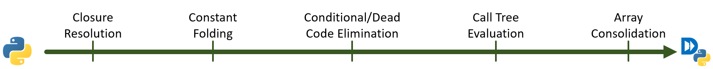

.. _python-frontend:

DaCe Python Frontend
====================

The DaCe Python frontend is a Python library that parses general Python code and generates SDFGs.
Briefly, it works by parsing the Python AST, preprocessing it into a more suitable form, and then creates the SDFG
by traversing the AST. Upon parsing, Python elements can be (a) parsed to equivalent SDFG components; (b) parsed to 
:ref:`Library Nodes <libnodes>` to be subsequently specialized for each platform; or (c) if containing unsupported features
(e.g., recursion), converted into callbacks to the Python interpreter, raising a warning in the process.

The process is summarized in the following diagram:

The preprocessing step is necessary to support certain Python features, such as object-oriented
programming. It is composed of several AST passes that transpile Python into Python:

Below, more information can be found on the specifics of Python parsing, the involved classes, and the NumPy
capabilities DaCe provides by default.

.. toctree::
    :maxdepth: 1

    parsing
    pysupport
    npsupport

..  preprocessing
    