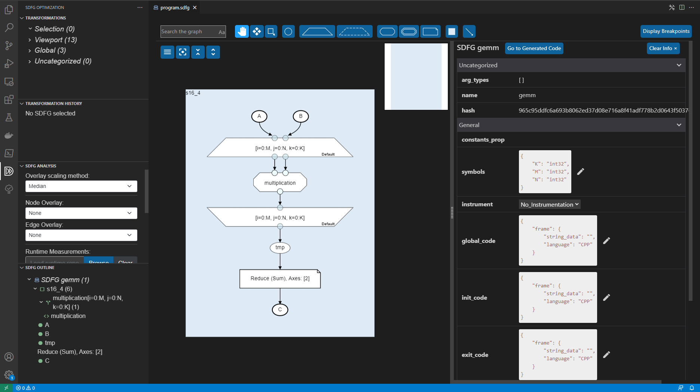

DaCe Visual Studio Code Extension
=================================

The DaCe Visual Studio Code (VS Code) extension provides a rich editor for SDFGs with included
profiling, debugging, static analysis, and interactive optimization. The extension is available
for free through the built-in
`VS Code marketplace <https://marketplace.visualstudio.com/items?itemName=phschaad.sdfv>`_.
The extension is maintained `separately from DaCe on GitHub <https://github.com/spcl/dace-vscode>`_,
where issues and feature requests can be reported.

.. image:: ./images/vscode_demo.gif
    :width: 800
    :alt: A demonstration of the VS Code UI.

Naviagtion
----------

SDFGs can be opened and edited by openining the corresponding `.sdfg` file through the native
VS Code file interface, or directly from code using :func:`~dace.sdfg.sdfg.SDFG.view`.

The SDFG editor is split into three main components, all shown in the image below:
The **main SDFG view** (center),
a **details panel** next to it (right),
and an **SDFG Optimization panel** in the VS Code action bar (left),
which is shared between all open SDFG editors.

**SDFG Optimization Panel**

- This panel offers an *SDFG Outline* (bottom left), which provides a
  hierarchical overview of the viewed SDFG. This outline can be used for quick navigation through
  the graph by moving the view to any listed element when clicked.

**Main SDFG View**

- The main SDFG view shows the program graph, wich can be explored with zoom-and-pan navigation
  similar to Google Maps.
- The hierarchical nature of SDFGs allows individual hierarchies to be collapsed or folded
  to view the graph on different levels of detail.
- Tooltips provide contextual information for elements such as Memlets, showing their accessed
  subset and logical data movement volume.

**Details Panel**

- By selecting graph elements in the main SDFG view, more information about them,
  such as their properties, is listed in the details panel.
- The `Go to source` button opens the source code file that generated the SDFG (if available)
  and navigates to the line(s) of code corresponding to the selected graph element.
- The `Go to Generated Code` button opens source code file containing the code generated by
  this SDFG (if available) and navigates to the line(s) of code corresponding to the selected
  graph element.

Editing
-------
SDFG element properties can be changed, added, or removed here.

Optimization
------------

Compiling / Running SDFGs
-------------------------

