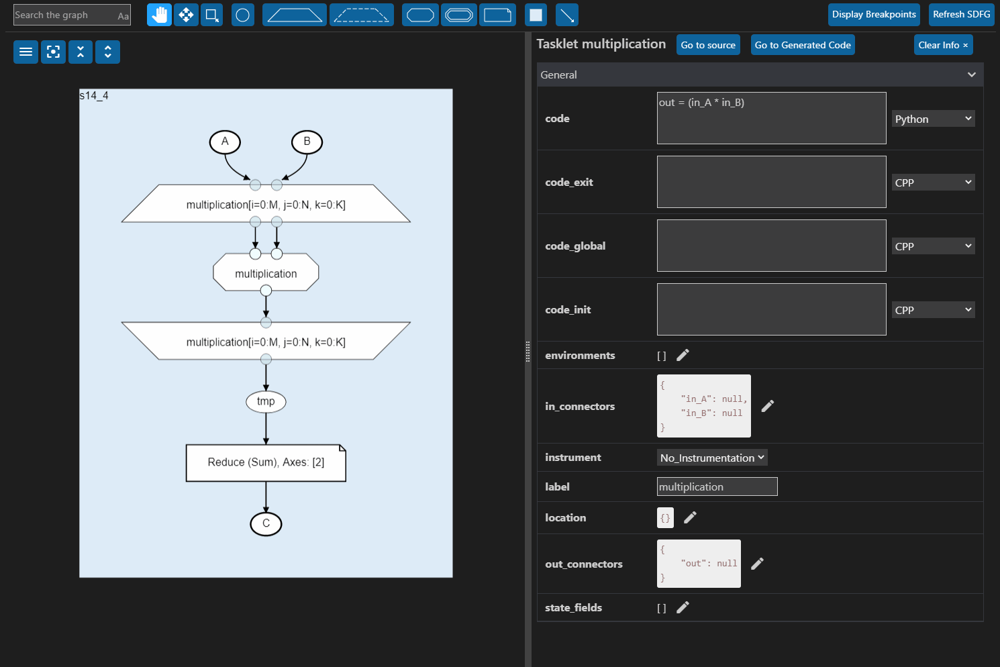
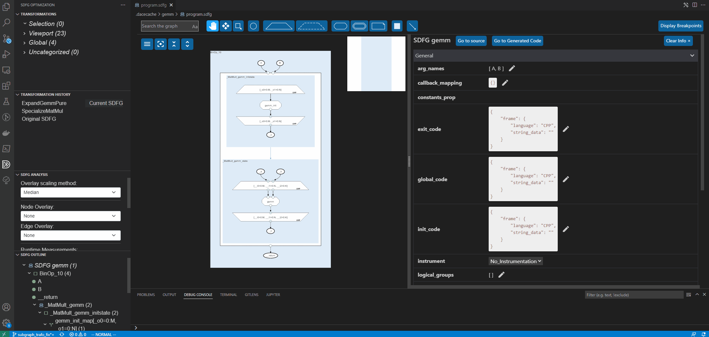

.. _vscode:

DaCe Visual Studio Code Extension
=================================

The DaCe Visual Studio Code (VS Code) extension provides a rich editor for SDFGs with included
profiling, debugging, static analysis, and interactive optimization. The extension is available
for free through the built-in
`VS Code marketplace <https://marketplace.visualstudio.com/items?itemName=phschaad.sdfv>`_.
The extension is maintained `separately from DaCe on GitHub <https://github.com/spcl/dace-vscode>`_,
where issues and feature requests can be reported.

.. figure:: ./images/vscode_demo.gif
    :width: 800
    :alt: A demonstration of the VS Code UI.

|

Naviagtion
----------

SDFGs can be opened and edited by openining the corresponding :code:`.sdfg` file through the native
VS Code file interface, or directly from code using :func:`~dace.sdfg.sdfg.SDFG.view` on an SDFG.

The SDFG editor is split into three main components, all shown in the image below:
The **main SDFG view** (center),
a **details panel** next to it (right),
and an **SDFG Optimization panel** in the VS Code action bar (left),
which is shared between all open SDFG editors.

|

**SDFG Optimization Panel**

- This panel offers an *SDFG Outline* (bottom left), which provides a
  hierarchical overview of the viewed SDFG. This outline can be used for quick navigation through
  the graph by moving the view to any listed element when clicked.
- For a more detailed overview of this panel, and its capabilities,
  please see :ref:`optimization_vscode`.

**Main SDFG View**

- The main SDFG view shows the program graph, wich can be explored with zoom-and-pan navigation
  similar to Google Maps.
- The entire SDFG can be brought in to view using the *'zoom to fit'* button |zoom-to-fit-button|.
- The hierarchical nature of SDFGs allows individual hierarchies to be collapsed or folded
  to view the graph on different levels of detail. The *'collapse all'* button |collapse-all-button|
  can be used to collapse all hierarchy levels, and the *'expand all'* button
  |expand-all-button| expands every level.
- Tooltips provide contextual information for elements such as Memlets, showing their accessed
  subset and logical data movement volume.

**Details Panel**

- By selecting graph elements in the main SDFG view, more information about them,
  such as their properties, is listed in the details panel. Multiple elements can be selected
  at the same time using the *'box select'* tool |box-select-button|, or by holding down the Shift key
  when selecting elements.
- The *'Go to source'* button opens the source code file that generated the SDFG (if available)
  and navigates to the line(s) of code corresponding to the selected graph element.
- The *'Go to Generated Code'* button opens source code file containing the code generated by
  this SDFG (if available) and navigates to the line(s) of code corresponding to the selected
  graph element.

Editing
-------

SDFG element properties, such as schedules, names, and data types, can be changed,
added, or removed in the details panel.
Properties of individual elements can be viewed and edited by selecting the corresponding elemet
in the main SDFG view, while clicking anywhere on the background in the main SDFG view brings
up the top-level SDFG's properties for editing.

|

The main SDFG view further allows for editing of the SDFG structure itself.
Elements can be selected from the top bar and can be added to the graph by clicking on any valid
position. Invalid positions are shown when the element preview under the cursor turns red, such as
when trying to add an AccessNode or a Tasklet outside of an SDFG State.

Graph elements or States can be connected with edges by selecting the edge tool |add-edge-button| in
the top toolbar, and then clicking on the source element, followed by the destination element.

To delete graph elements, the element or elements can be selected and removed by pressing the Delete
key (keyboard).

Graph elements can be moved around freely using the move tool |move-element-button|, which updates
and saves their positions to manually change the graph layout.

Newly added elements or edges can be adjusted through the details panel. The image below shows
a demonstration of adding a new AccessNode, connecting it to an existing node through a graph edge,
and then editing its properties. Further demonstrated is the removal of an existing node, as well as
moving a node to a different position.

.. figure:: ./images/sdfg_adding_elements.gif
    :width: 800
    :alt: Demonstration of adding and editing SDFG elements.

|

Optimization
------------

An SDFG's performance can be analyzed in detail and subsequently optimized using transformations
from witin the editor. For details, please see :ref:`optimization_vscode`.

.. figure:: ./images/sdfg_optimization.gif
    :width: 800
    :alt: Demonstration of optimizing SDFGs through graph transformations.

|

Compiling / Running SDFGs
-------------------------

**Compiling**

SDFGs can be compiled through the user interface, using the *'Compile SDFG'* button |compile-sdfg-button|
in the top right of the SDFG editor. This generates the code and corresponding library for the current
SDFG in the default location (:code:`.dacecache` folder, if not modified through the :code:`.dace.conf`).

A demonstration of compiling an SDFG can be seen below. In the example, an SDFG is compiled,
the generated code for a specific graph element is opened via the details panel, a transformation
is applied, tiling the map, before the graph is re-compiled and the changed generated code becomes
visible.

|

**Running**

The native VS Code launch configurations and interface can be used to run, debug, or profile SDFGs.

The recommended way of running SDFGs involves creating a :code:`launch.json` file through VS Code. For
more information on how to create a launch configuration, please refer to the current version of
`VS Code's documentation <https://code.visualstudio.com/docs/editor/debugging#_launch-configurations>`_.
The launch configuration preset to use is called "SDFG: Run current file".
With this configuration selected, open the SDFG you wish to run, and start the configuration by either
pressing F5 on the keyboard, or clicking on the play button next to the configuration.
VS Code will attempt to determine the original Python source file which generated the SDFG, which will
then be used to run the optimized graph by compiling and linking against the pre-compiled graph.
If the original source file cannot be determined automatically, a prompt appears, asking the user to
provide such a file.
