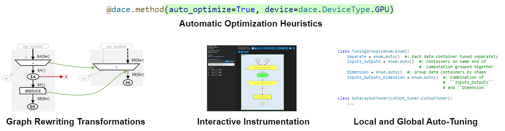

.. _optimization:

Optimizing Programs
===================

Once created, SDFGs can be optimized by a variety of means. 

The experimental :ref:`automatic optimization heuristics <opt_auto>` provides a good (but likely not optimal) starting
point. Be sure to install and :ref:`use fast libraries <blas>`, if they exist for your hardware.

Manual optimization can then provide more fine-grained control over the performance aspects of the code.
To determine which optimizations work best, SDFGs can be analyzed for performance bottlenecks using 
:ref:`profiling`, or visually through :ref:`static and runtime analysis <optimization_vscode>`.
With this information in hand, the SDFG can be optimized using **transformations**, **passes**, or **auto-tuning**.

The most common type of optimization is local :ref:`transformations <transformations>`. For example, the 
:class:`~dace.transformation.interstate.sdfg_nesting.InlineSDFG` transformation inlines a nested SDFG
into its parent SDFG. This transformation is applied to a single SDFG, and does not require any information from other SDFGs.
As opposed to local transformations, :ref:`passes <pass>` are globally applied on an SDFG, are can be used to perform
whole-program analysis and optimization, such as memory footprint reduction in :class:`~dace.transformation.passes.transient_reuse.TransientReuse`.

Transforming a program is often a sequence of iterative operations.
Some transformations do not necessarily improve the performance of an SDFG, but are a "stepping stone" for other
transformations, for example :class:`~dace.transformation.dataflow.tiling.MapTiling` on a map can lead to 
:class:`~dace.transformation.dataflow.local_storage.InLocalStorage` being available on the memlets.
When working with specific platforms, be sure to read the **Best Practices** documentation entries linked below. It is also
recommended to read vendor-provided documentation on how to maximize performance on that platform.

Finally, our experimental auto-tuning API allows for automatic optimization of SDFGs by searching over the set of possible
configurations. This is done by :ref:`evaluating the performance of each configuration <auto_tuning>` and selecting the best one.
For example, :class:`~dace.optimization.map_permutation_tuner.MapPermutationTuner` automatically tunes the order of 
multi-dimensional maps for the best performance, and :class:`~dace.optimization.data_layout_tuner.DataLayoutTuner` globally 
tunes the data layout of arrays.

The following resources are available to help you optimize your SDFG:

  * Using transformations: `Using and Creating Transformations <https://nbviewer.org/github/spcl/dace/blob/master/tutorials/transformations.ipynb>`_
  * Creating optimized schedules that can match optimized libraries: `Matrix multiplication CPU and GPU optimization example <https://github.com/spcl/dace/blob/master/samples/optimization/matmul.py>`_
  * Auto-tuning and instrumentation: `Tuning data layouts sample <https://github.com/spcl/dace/blob/master/samples/optimization/tuning.py>`_

The following subsections provide more information on the different types of optimization methods:

.. toctree::
    :maxdepth: 1
    
    profiling
    blas
    vscode
    gpu
    fpga

.. interactive
.. guidelines
    
