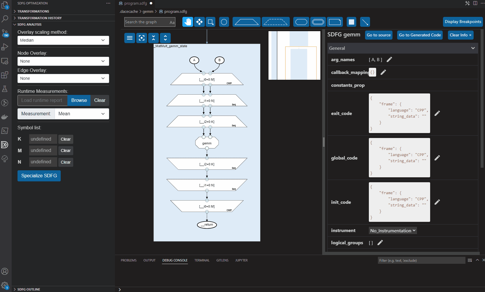
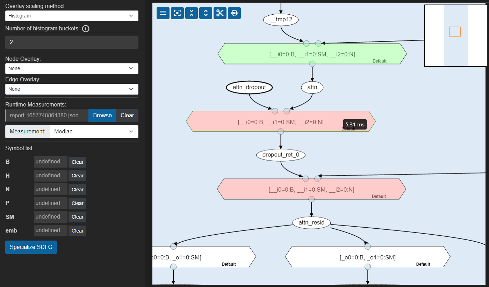
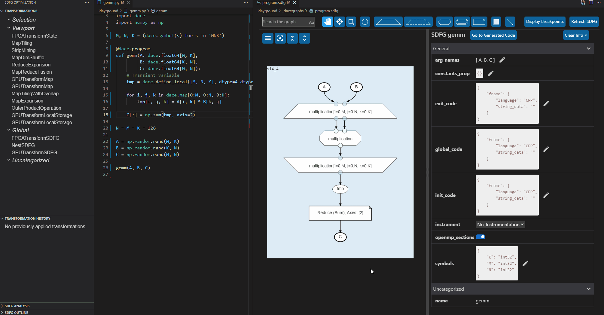
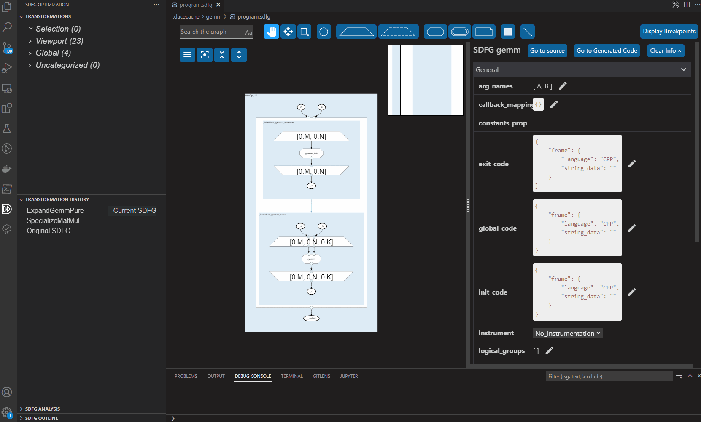
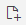
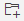

.. _optimization_vscode:

Using Visual Studio Code for Optimization
=========================================

SDFGs can be fully optimized from within Visual Studio Code (VS Code) using the rich SDFG editor.
A suite of :ref:`analysis tools <sdfg_performance_analysis>` helps with performance diagnostics,
before a program can be conveniently optimized using
:ref:`one-click graph transformations <vscode_transformations>`.

.. _sdfg_performance_analysis:

Performance Analysis
--------------------

Static Analysis
~~~~~~~~~~~~~~~

SDFGs can be analyzed statically without the need for costly profiling with a set of overlays.
Overlays are shown as heat- or color-maps directly on top of the graph to indicate specific metrics
selected by the user. A selection of these heatmaps, as well as fine-grained control over their
behavior is provided in a separate **SDFG Analysis** section in the SDFG Optimization sidepanel.

Overlays can be activated for both graph edges, and graph nodes, showing things such as the
operational intensity or arithmetic operations count, the amount of logical data movement volume,
or the storage location of individual data containers.

To predict how program behavior changes with respect to input parameters or data sizes, undefined
symbols can be parameterized, causing the heatmap overlays to be updated on-the-fly.

|

Fine-Grained Data Access and Reuse Analysis (Experimental)
~~~~~~~~~~~~~~~~~~~~~~~~~~~~~~~~~~~~~~~~~~~~~~~~~~~~~~~~~~

.. note:: This feature is still in development and is only available in certain pre-release versions of the VS Code extension at this time. This feature may consequently be subject to changes.

To analyze the fine-grained data access and reuse behavior of an application, an SDFG can be
parameterized with small toy parameters using the *'Specialize SDFG'* button in the SDFG Analysis pane.
After setting all free parameters to small toy values, one or more elements in the SDFG can be selected,
such as a state, and can be transitioned into the **local view**.

In this local view, the parameterized subgraph is used to simulate its concrete data access pattern.
This pattern is used to:

- Visualize which data elements are dependent on which other data elements.
- Visualize the physical memory layout of data containers by showing cache lines on data containers.
- Calculate the reuse distance between individual data accesses, which subsequently is used to
  calculate the expected number of cache misses and consequently the amount of physical data movement.
  All three metrics are visualized on the graph using heatmaps.
- Show the access pattern of individual map scopes by allowing the user to play back said pattern with an
  animation, or step through individual accesses interactively.

.. figure:: ../ide/images/localview_demo.gif
    :width: 800
    :alt: Demonstrating the fine-grained data access and reuse analysis.

|

Runtime Analysis and Instrumentation
~~~~~~~~~~~~~~~~~~~~~~~~~~~~~~~~~~~~

The SDFG Analysis section further enables loading of instrumentation reports, which loads and visualizes
data gathered through instrumentation on the SDFG, such as individual timing measurements, or hardware /
performance counter values.

Instrumentation reports can be loaded through the SDFG Analysis section's *'Browse'* button. Such
reports should be presented in JSON format. Once loaded, the overlay visualizes aggregated measurements
and provides details through tooltips.

|

.. _vscode_transformations:

SDFG Optimization and Transformations
-------------------------------------

Applying Transformations
~~~~~~~~~~~~~~~~~~~~~~~~

SDFGs can be optimized using transformations from within the editor.
The SDFG Optimization sidepanel lists applicable transformations for the currently
opened graph in the top right. This list of transformations is categorized and sorted by relevance
to what SDFG elements are currently in view and/or selected.

Hovering over trainsformations highlights the graph elements that are affected by them.

By clicking a transformation, the transformation description and properties appear in the details
panel, and the properties can be adjusted arbitrarily. From here, a button zooms to the
affected graph nodes, the transformation can be previewed on the graph, or the transformation can
be applied using the provided properties. A transformation can be applied using the default
properties with a single click by selecting `Quick Apply` in the transformation list.

|

Transformation History
~~~~~~~~~~~~~~~~~~~~~~

A separate section in the SDFG Optimization sidepanel lists a chronological history of applied
transformations for a given graph.
This list allows for navigation of the SDFG history, and exploring different points in the optimization
process.
By clicking a certain point in the history, the graph at that history state is shown in a preview.
Clicking *'Revert To'* reverts the SDFG to that point.

|

.. _vscode_custom_transformations:

Custom Transformations
~~~~~~~~~~~~~~~~~~~~~~

To extend the included repertoire of optimizations, custom transformations can be added.
Valid transformations can be added in the top-bar of the transformation list, either from a single
file |add-xform-by-file-btn|, or by adding an entire folder of
transformations |add-xform-by-folder-btn|. The latter recursively traverses the provided folder
for any Python source code files and attempts to load each one as a transformation.

For more information on how to use and author data-centric transformations,
see the `Using and Creating Transformations <https://nbviewer.jupyter.org/github/spcl/dace/blob/master/tutorials/transformations.ipynb>`_
tutorial
