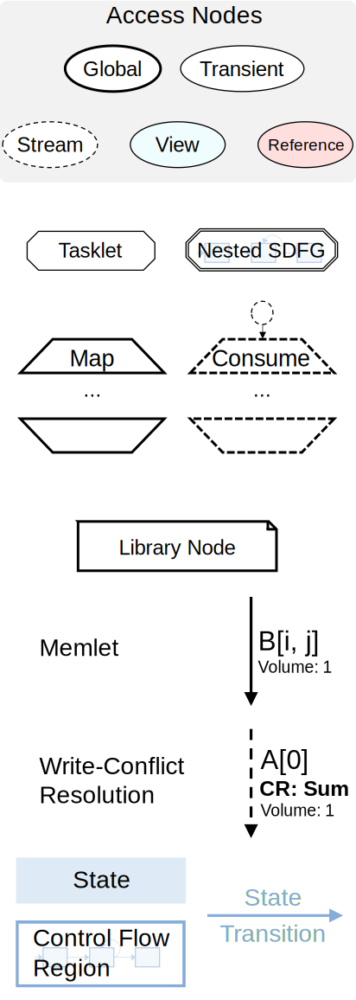

.. _sdfg:

Stateful Dataflow multiGraphs (SDFG)
====================================

Philosophy
----------

The central tenet of our approach is that understanding and optimizing data movement is the key to portable, 
high-performance code. In a data-centric programming paradigm, three governing principles guide execution:

    1. Data containers must be separate from computations.
    2. Data movement must be explicit, both from data containers to computations and to other data containers.
    3. Control flow dependencies must be minimized, and only define execution order if no implicit dataflow is given.

As opposed to instruction-driven execution that augments analyses with dataflow (i.e., the *control-centric* view), 
execution in the *data-centric* view is data-driven. This means that concepts such as parallelism are inherent to
the representation, and can be scheduled to run efficiently on a wide variety of platforms. 

Some of the main differences between SDFGs and other representations are:

    * Scoping is different: instead of functions and modules, in SDFGs the scopes relate to dataflow: a 
      scope can be a graph, a parallel region (see :ref:`sdfg-map`), or anything that has regions of data passed in/out of it.
    * There are two kinds of scalar values: **scalar** data containers and **symbols** (see :ref:`sdfg-symbol` for more
      information).
    * We make a distinction between three types of data movement: **read**, **write**, and **update** (for which we
      use a write-conflict resolution function). See :ref:`sdfg-memlet` for more details.

The Language
------------

In a nutshell, an SDFG is a state machine of acyclic dataflow multigraphs. Here is an example graph:

.. raw:: html

  <iframe width="100%" height="500" frameborder="0" src="../_static/embed.html?url=sdfg/example.sdfg"></iframe>

.. note::
  Use the left mouse button to navigate and scroll wheel to zoom. Hover over edges or zoom into certain nodes (e.g., 
  tasklets) to see more information.

The cyan rectangles are called **states** and together they form a state machine, executing the code from the starting
state and following the blue edge that matches the conditions. In each state, an acyclic multigraph controls execution
through dataflow. There are four elements in the above state:

    * **Access nodes** (ovals) that give access to data containers
    * **Memlets** (edges/dotted arrows) that represent units of data movement
    * **Tasklets** (octagons) that contain computations (zoom in on the above example to see the code)
    * **Map scopes** (trapezoids) representing parametric parallel sections (replicating all the nodes inside them N x N
      times)

Dataflow is captured in the memlets, which can go from access nodes and tasklets to each other, moving through map
scopes. As you can see in the example, a memlet can split after going into a map, as the parallel region forms a scope.

The state machine shown in the example is a for-loop (``for _ in range(5)``). The init state is where execution starts,
the guard state controls the loop, and at the end the result is copied to the special ``__return`` data container, which
designates the return value of the function.

There are other kinds of elements in an SDFG, as detailed below.

.. _sdfg-lang:

Elements
~~~~~~~~

  Elements of the SDFG IR.

**Access Node**:

An access node will take the form of the data container it's pointing to. For example, if the data container is a
stream, the line around it would be dashed.
For more information, see :ref:`descriptors`.

**Tasklet**: *must not access any external memory apart from what is given to it*.

Tasklets can be written in any language, as long as the code generator supports it. The recommended language is always
Python (even if the source language is different), because then tasklets can be analyzed. Other supported languages are
C++, MLIR, SystemVerilog, and others (see :class:`~dace.dtypes.Language`).

**Nested SDFG**: Nodes that contain an entire SDFG in a state. When invoked, the nested SDFG will be executed in that
context, independently from other instances if parallel.
The semantics are similar to a Tasklet: connectors specify input and output parameters, and there is acyclic dataflow
going in and out of the node. However, as opposed to a Tasklet, a nested SDFG is completely analyzable.

Such nodes are useful when control flow is necessary in parallel regions. For example, when there is a loop inside a map,
or when two separate components need to each run its own state machine.

Several transformations (e.g., :class:`~dace.transformation.interstate.sdfg_nesting.InlineSDFG`, :class:`~dace.transformation.dataflow.map_fission.MapFission`)
work directly with nested SDFGs, and the :ref:`simplify` tries to remove/inline them as much as possible.

**Map**:

For more information, see :ref:`sdfg-map`.

**Consume**:

**Library Node**:

For more information, see :ref:`libnodes`.

**Memlet**: Data movement unit. Mention WCR here.

For more information, see :ref:`sdfg-memlet`.

**State**: Contains any of the above dataflow elements.

**State Transition** (inter-state edge): Condition, assignments

.. _descriptors:

Data Containers and Access Nodes
~~~~~~~~~~~~~~~~~~~~~~~~~~~~~~~~

Data container types: array/scalar/stream.

See :class:`~dace.data.Array` for how it is allocated and how to customize this behavior.

Transient property, aliasing assumptions. Allocation lifetime

Views and references, see :ref:`below <viewref-lang>`.

.. _sdfg-symbol:

Symbols
~~~~~~~~
Scalars vs. symbols

The SDFG symbol storage and what it means.
We say that a symbol that does not have a defined value is a *free symbol*.

.. _sdfg-memlet:

Memlets
~~~~~~~

anatomy of a memlet

Reads and writes are self-explanatory, and updates can be implemented in a platform-dependent way, for example atomic
operations, or different kinds of accumulators on FPGAs. 

No WCR for streams.

Connectors
~~~~~~~~~~

Connectors have types.

Image with tasklet connectors (which are used in the tasklet), side by side with a map with two input connectors
and two input edges, and three output edges. Three of them marked in orange and the connector names are shown. 

Mention *memlet paths* and the general *memlet tree* that can go through arbitrary scopes

.. _sdfg-map:

Parametric Parallelism
~~~~~~~~~~~~~~~~~~~~~~

Map consume
schedule types

**Dynamic Map Ranges**: 

Explain + example (image / embedded viewer)

.. _viewref-lang:

Views and References
~~~~~~~~~~~~~~~~~~~~

What is a *View* and what does it do?

Similarly to a NumPy view, a View is created whenever an array is sliced, reshaped, or reinterpreted, among other things.
It never creates a copy, in C it would be equivalent to setting a pointer, though in DaCe it is more confined.

Why is it useful

A view is always connected to a data container from one side. In case of ambiguity, the ``views`` connector points to
the data being viewed. 

Another place where views can be found is in a Nested SDFG connector: any data container in a nested SDFG is a view of
the memlet going in or out of it.

As opposed to Views, *References* can be set in one place (using the ``set`` connector), and then be used as normal access nodes
later anywhere else. They can be set to different containers (even more than once), as long as the descriptors match (like
views). References are useful for patterns such as multiple-buffering (``a, b = b, a``) and polymorphism.

Since references detach the access node from the data container, it inhibits the strength of data-centric analysis for
transformations and optimization. Frontends generate them only when absolutely necessary. 
Therefore, **use references sparingly** (or not at all, if possible).

.. _libnodes:

Library Nodes
~~~~~~~~~~~~~

.. _memprop:

Memlet Propagation
------------------

The process is triggered automatically by the Python frontend. If you want to trigger it manually on an entire SDFG, call
:func:`~dace.sdfg.propagation.propagate_memlets_sdfg`. For a local scope, use :func:`~dace.sdfg.propagation.propagate_memlets_scope`,
and for a single memlet use :func:`~dace.sdfg.propagation.propagate_memlet`. If you only want to trigger the part that propagates
symbol values across the SDFG state machine, call :func:`~dace.sdfg.propagation.propagate_states`.

.. _sdfg-api:

SDFG Builder API
----------------

``add_node`` etc.

What to Avoid
-------------

SDFGs are Turing complete. However, not everything can be represented concisely.

Parametric-depth recursion for example (could potentially make a stack, but will be slow)

References with different sizes (dynamic pointers etc.)

DaCe Frontends try to encapsulate those away

.. _format:

``.sdfg`` File Format
---------------------

An SDFG file is a JSON file that contains all the properties of the graph's elements. See :ref:`properties` for more
information about how those are saved.

You can save an SDFG to a file in the SDFG API with the :func:`~dace.sdfg.sdfg.SDFG.save` method. Loading an SDFG from a
file uses the :func:`~dace.sdfg.sdfg.SDFG.from_file` static method. For example, in the following save/load roundtrip:

.. code-block:: python

    @dace.program
    def example(a: dace.float64[20]):
        return a + 1
    sdfg = example.to_sdfg()  # Create an SDFG out of the DaCe program

    sdfg.save('myfile.sdfg')  # Save
    new_sdfg = dace.SDFG.from_file('myfile.sdfg')  # Reload

    assert sdfg.hash_sdfg() == new_sdfg.hash_sdfg()  # OK, SDFGs are the same

The ``compress`` argument can be used to save a smaller (``gzip`` compressed) file. It can keep the same extension,
but it is customary to use ``.sdfg.gz`` or ``.sdfgz`` to let others know it is compressed.

