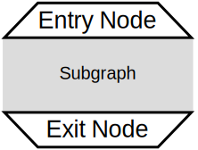
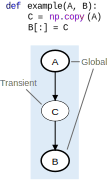
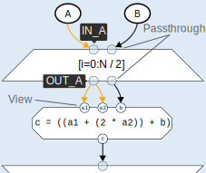
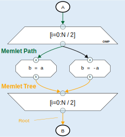
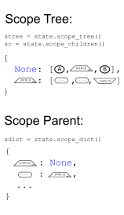
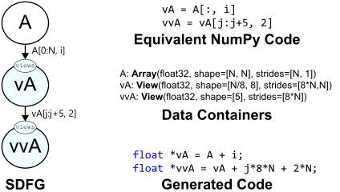
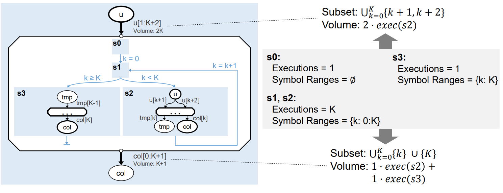

.. _sdfg:

Stateful Dataflow multiGraphs (SDFG)
====================================

Philosophy
----------

The central tenet of our approach is that understanding and optimizing data movement is the key to portable, 
high-performance code. In a data-centric programming paradigm, three governing principles guide execution:

    1. Data containers must be separate from computations.
    2. Data movement must be explicit, both from data containers to computations and to other data containers.
    3. Control flow dependencies must be minimized, and only define execution order if no implicit dataflow is given.

As opposed to instruction-driven execution that augments analyses with dataflow (i.e., the *control-centric* view), 
execution in the *data-centric* view is data-driven. This means that concepts such as parallelism are inherent to
the representation, and can be scheduled to run efficiently on a wide variety of platforms. 

Some of the main differences between SDFGs and other representations are:

    * Scoping is different: instead of functions and modules, in SDFGs the scopes relate to dataflow: a 
      scope can be a graph, a parallel region (see :ref:`sdfg-map`), or anything that has regions of data passed in/out of it.
    * There are two kinds of scalar values: **scalar** data containers and **symbols** (see :ref:`sdfg-symbol` for more
      information).
    * We make a distinction between three types of data movement: **read**, **write**, and **update** (for which we
      use a write-conflict resolution function). See :ref:`sdfg-memlet` for more details.

The Language
------------

In a nutshell, an SDFG is a state machine of acyclic dataflow multigraphs. Here is an example graph:

.. raw:: html

  <iframe width="100%" height="500" frameborder="0" src="../_static/embed.html?url=sdfg/example.sdfg"></iframe>

.. note::
  Use the left mouse button to navigate and scroll wheel to zoom. Hover over edges or zoom into certain nodes (e.g., 
  tasklets) to see more information.

The cyan rectangles are called **states** and together they form a state machine, executing the code from the starting
state and following the blue edge that matches the conditions. In each state, an acyclic multigraph controls execution
through dataflow. There are four elements in the above state:

    * **Access nodes** (ovals) that give access to data containers
    * **Memlets** (edges/dotted arrows) that represent units of data movement
    * **Tasklets** (octagons) that contain computations (zoom in on the above example to see the code)
    * **Map scopes** (trapezoids) representing parametric parallel sections (replicating all the nodes inside them N x N
      times)

Dataflow is captured in the memlets, which connect access nodes and tasklets and pass through scopes (such as maps).
As you can see in the example, a memlet can split after going into a map, as the parallel region forms a scope.

The state machine shown in the example is a for-loop (``for _ in range(5)``). The init state is where execution starts,
the guard state controls the loop, and at the end the result is copied to the special ``__return`` data container, which
designates the return value of the function.

There are other kinds of elements in an SDFG, as detailed below.

.. _sdfg-lang:

Elements
~~~~~~~~

.. figure:: images/elements.svg
  :figwidth: 40%
  :align: right
  :alt: Elements of the SDFG IR.

  Elements of the SDFG IR.

**Access Node**: A node that points to a named data container. An edge going out of one would read from the container 
and an edge going into one would write or update the memory. There can be more than one instance of the same container,
even in the same state (see above example).

An access node will take the form of the data container it is pointing to. For example, if the data container is a
stream, the line around it would be dashed.
For more information, see :ref:`descriptors`.

**Tasklet**: Tasklets are the computational nodes of SDFGs. They can perform arbitrary computations, with one restriction:
*they must not access any external memory apart from what is given to them via edges*. In the data-centric paradigm, 
Tasklets are viewed as black-boxes, which means that only limited analysis is performed on them, and transformations rarely
use their contents.

Tasklets can be written in any language, as long as the code generator supports it. The recommended language is always
Python (even if the source language is different), which allows the limited analysis (e.g., operation count). Other
supported languages are C++, MLIR, SystemVerilog, and others (see :class:`~dace.dtypes.Language`).

**Nested SDFG**: Nodes that contain an entire SDFG in a state. When invoked, the nested SDFG will be executed in that
context, independently from other instances if parallel.
The semantics are similar to a Tasklet: connectors specify input and output parameters, and there is acyclic dataflow
going in and out of the node. However, as opposed to a Tasklet, a nested SDFG is completely analyzable.

Such nodes are useful when control flow is necessary in parallel regions. For example, when there is a loop inside a map,
or when two separate components need to each run its own state machine.
Several transformations (e.g., :class:`~dace.transformation.interstate.sdfg_nesting.InlineSDFG`, :class:`~dace.transformation.dataflow.map_fission.MapFission`)
work directly with nested SDFGs, and the :ref:`simplify` tries to remove/inline them as much as possible.

To use the inputs and outputs, the node's connectors have data containers with matching names in the internal SDFG. To
pass symbols into the SDFG, the :class:`~dace.sdfg.nodes.NestedSDFG.symbol_mapping` is a dictionary mapping from internal
symbol names to symbolic expressions based on external values. Symbols cannot be transferred out of the nested SDFG (as
this breaks the assumptions behind symbol values, see :ref:`sdfg-symbol` for more information).

  SDFG scope nodes.

**Map**: A scope that denotes parallelism. Maps consist of at least two nodes: entry (trapezoid) and exit (inverted
trapezoid) nodes. Those nodes are annotated with parameters and symbolic ranges, which specify the parallel iteration space.
The two nodes can wrap an arbitrary subgraph by dominating and post-dominating the contents, which
means that every edge that originates from outside the scope must go through one of the entry/exit nodes. In the SDFG
language, the subgraph within the map scope is replicated a parametric number of times and can be scheduled to different
computational units (e.g., CPU cores). For more information, see :ref:`sdfg-map`.

**Consume**: The streaming counterpart to the Map scope, denoting parametric parallelism via multiple consumers in a
producer/consumer relationship. There is always a Stream access node connected directly to the consume scope, which
will be processed by the number of processing elements (PEs) specified on the nodes. Additionally, an optional quiescence
condition can be used to specify early stopping for consuming. By default, consumption will stop when the input stream is
empty for the first time. Note that a stream can also be an output of a consume scope, so you can keep producing more
tasks for the same scope as you are consuming (useful for unrolling recursion).

**Library Node**: A high-level node that represents a specific function (e.g., matrix multiplication). During compilation
and optimization, Library Nodes are *expanded* to different implementations, for example to call a fast library (e.g., 
CUBLAS, MKL), or to a native SDFG representation of it. For more information, see :ref:`libnodes`.

**Memlet**: Data movement unit. The memlet contains information about which data is being moved, what are the constraints
of the data being moved (the *subset*), how much data is moved (*volume*), and more. If the movement specifies an update,
for example when summing a value to existing memory, there is no need to read the original value with an additional memlet.
Instead, a *write-conflict resolution* (WCR) function can be specified: the function takes the original value and the
new value, and specifies how the update is performed. In the summation example, the WCR is 
``lambda old, new: old + new``. For more information, see :ref:`sdfg-memlet`.

**State**: Contains any of the above dataflow elements. A state's execution is entirely driven by dataflow, and at the
end of each state there is an implicit synchronization point, so it will not finish executing until all the last nodes
have been reached (this assumption can be removed in extreme cases, see :class:`~dace.sdfg.state.SDFGState.nosync`).

**State Transition**: Transitions, internally referred to as *inter-state edges*, specify how execution proceeds after
the end of a State. Inter-state edges optionally contain a symbolic *condition* that is checked at the end of the
preceding state. If any of the conditions are true, execution will continue to the destination of this edge (the
behavior if more than one edge is true is undefined). If no condition is met (or no more outgoing edges exist), the
SDFG's execution is complete. State transitions also specify a dictionary of *assignments*, each of which can set a
symbol to a new value (in fact, this is **the only way in which a symbol can change its value**). Both conditions and
assignments can depend on values from data containers, but can only set symbols. The condition/assignment
properties allow SDFGs to represent control flow constructs, such as for-loops and branches, in a concise manner.

.. _descriptors:

Data Containers and Access Nodes
~~~~~~~~~~~~~~~~~~~~~~~~~~~~~~~~

  Transients and globals.

For every access node in an SDFG, there is a matching named **data container**. Data containers are objects that
contain accessible data (not necessarily randomly-accessible, however), which can originate from within the SDFG or
externally. We call memory that is managed internally in the SDFG *transient*. All data containers, whether transient
or global, are registered in ``sdfg.arrays`` along with their descriptors, which descibe their properties, such 
as shape and layout.

Transience is useful for several reasons. First, DaCe can fully analyze those containers and accesses to them, including
knowing that they never alias in memory addresses. Second, since they are managed by the SDFG, they could be mutated or
removed completely by transformations.
On the right-hand side, the figure shows a code and its corresponding SDFG. As ``C`` is generated inside the program,
its memory is transient, and a subsequent pass will remove its allocation. 

Data container types in DaCe are user-extensible, and all extend the :class:`~dace.data.Data` class. 
The data container types built into DaCe are:

   * :class:`~dace.data.Array`: Random-access multidimensional arrays with a flexible allocation scheme. 
     See :class:`~dace.data.Array` for how it is allocated and how to customize this behavior.
   * :class:`~dace.data.Scalar`: Memory allocated for a single value. Can be seen as a "0-dimensional array".
   * :class:`~dace.data.Stream`: A single or multidimensional array of First-In-First-Out (FIFO) queues. A memlet
     pointing to a stream would push one or more values to it (depending on the source data volume), whereas a memlet
     from it would pop elements. For example, a memlet pointing to ``S[5, 2]`` would push to the (5, 2)-th queue in the 
     given stream array. See :class:`~dace.data.Stream` for more properties that define their structure.
   * :class:`~dace.data.View`: A reinterpretation of an array or sub-array (for example, a slice, or a reshaped array).
     Must be directly connected to the container it is viewing in every access node.
   * :class:`~dace.data.Reference`: A pointer to containers of the same description (shape, data type, etc.), which may
     be set to another container dynamically. **Warning**: inhibits data-centric analyses for optimization. 

For more information on Views and References, see :ref:`below <viewref-lang>`.

Apart from transience, shape, and data type (``dtype``), there are two important properties in each data descriptor
that pertain to how it will be mapped to hardware (and to the generated code): ``storage`` and ``lifetime``.

**Storage location** refers to where the container will be allocated --- examples include :class:`~dace.dtypes.StorageType.CPU_Heap`
for allocation using ``new[]`` and :class:`~dace.dtypes.StorageType.GPU_Global` for VRAM on the GPU (``{cuda,hip}Malloc``).
The full built-in list can be found in the enumeration definition :class:`~dace.dtypes.StorageType`. The enumeration is
user-extensible (see :ref:`enums`), so adding new entries is easy.

**Allocation lifetime** refers to the allocation/deallocation scope of a data container. By default, :class:`~dace.dtypes.AllocationLifetime.Scope`
is used, which specifies that the access nodes dictate the allocation lifetime --- the innermost common scope in which
the access nodes with the container's name are used create the allocation lifetime. This means that if an access node
only exists inside one map scope, the code generator would allocate an array inside it, and deallocate on scope end.
However, if another access node with the same name is used somewhere else in the SDFG State, the allocation scope will
become the whole state (or first/last executed state if in different states). There are other explicit options, such as 
:class:`~dace.dtypes.AllocationLifetime.SDFG`, which fix the lifetime, or even lifetime that *outlives a single SDFG execution*:
:class:`~dace.dtypes.AllocationLifetime.Persistent` (which can only be used on arrays with sizes that can be determined
at call-time) triggers allocation in the initialization function upon loading the SDFG library. Multiple invocations
will not re-allocate memory.

Lastly, constants from ``sdfg.constants`` can also be used with access nodes. This automatically happens, for example,
when using compile-time constant arrays:

.. code-block:: python

    @dace
    def cst():
        return np.array([1., 2., 1.])

    sdfg = cst.to_sdfg()
    print(sdfg.constants)        # Prints: {'__tmp0': array([1., 2., 1.])}
    print(sdfg.node(0).nodes())  # Prints: [AccessNode (__tmp0), AccessNode (__return)]

.. _sdfg-symbol:

Symbols
~~~~~~~~

Symbols and symbolic expressions are a core part of DaCe. They allow the framework to define arrays with unknown sizes,
while still validating them, inferring output shapes, and optimizing their use. They are also extensively used in memlets
to analyze memory access patterns, and in maps they define new symbols for use inside the scope. Lastly, in state
transitions DaCe uses symbolic analysis to  generate structured control flow from an arbitrary state machine (e.g.,
finding out if a transition is a negation of another, to create ``if/else``). Symbolic expressions are powered by 
`SymPy <https://www.sympy.org>`_, but extended by DaCe (:class:`~dace.symbolic.symbol`) to include types and other utilities.

Symbols can be used almost anywhere in DaCe --- any object property that is a :class:`~dace.properties.SymbolicProperty`
accepts them, and any :class:`~dace.subsets.Subset` is parametric. You can find such properties in data descriptors,
memlets, maps, inter-state edges, and others. You can also use them (**read-only**) in Tasklet code directly, as custom
properties of your library nodes or transformations, and more.

A particular reason that makes symbols useful is the fact they stay constant throughout their defined scope. A symbol 
defined in a scope (e.g., map parameter) cannot change at all, and symbols that are defined outside an SDFG state cannot
be modified inside a state, only in assignments of state transitions. 

The above read-only property differentiates between a :class:`~dace.symbolic.symbol` and a :class:`~dace.data.Scalar`:
Scalars have an assigned storage location (see :ref:`above <descriptors>`) and can be written to at any given point.
This means that Scalars cannot be used in symbolic expressions, as their value may change, or not be accessible altogether.
In contrast, symbols are always accessible on each device (the code generator ensures this).

.. raw:: html

  

    <iframe width="100%" height="320" frameborder="0" src="../_static/embed.html?url=sdfg/scalarsym.sdfg"></iframe>
    
Assigning a Scalar value to a symbol.<a class="headerlink" href="#scalarsym" title="Permalink to this image">¶</a>

  

In general, using a symbol is always preferable if: (a) its final value is not needed outside the SDFG; (b) its value is
necessary to e.g., specify a memlet index; and (c) it is not written to by a computation. The last condition can be
worked around if the Scalar is on the host memory using a state transition (see figure on the right, the assignment
takes the value of ``scal`` and assigns it to ``sym``, which can be used in subsequent states).

During :ref:`simplification <simplify>`, the :class:`~dace.transformation.passes.scalar_to_symbol.ScalarToSymbolPromotion`
pass tries to convert Scalars to symbols, if they fulfill all the constraints of a symbol.

Symbols that are defined outside a state can also be given to an SDFG as parameters. This is used when data containers
have symbolic sizes. We say that a symbol that does not have a defined value is a *free symbol*. The free symbols of an
SDFG have to be added to the symbol store (``sdfg.symbols``) using :func:`~dace.sdfg.sdfg.SDFG.add_symbol`.

.. note::
  For more information about developing with symbolic expressions, read :ref:`symbolic`.

.. _connectors:

Connectors
~~~~~~~~~~

  Connector types.

As SDFG states are acyclic multigraphs (where two nodes can have more than one edge between them), every edge needs a
port on the source/destination nodes to connect with. In SDFGs, we use *connectors* for this purpose. There are two types
of connectors: **view** (colored in cyan) and **passthrough** (colored in transparent turquoise). The former is used to specify
an endpoint on nodes, upon which the connector name can be used within that node (e.g., tasklet, nested SDFG, map entry
for dynamic map ranges). The latter passes through a scope node (such as a map) and allows DaCe to track the path of
memlets through that scope. An example of both is shown on the right.

A view connector does not need to define a data container. This is because connectors are references that take on the shape
of the memlet connected to it. However, connectors can have types of their own. By default, the type of a connector is
``None``, which means its type is inferred automatically by DaCe in :func:`~dace.sdfg.infer_types.infer_connector_types`.
If an type is defined, it acts as a "cast" of the data it is referring to. This is used, among other places, in SIMD
vectorization. For example, an access :pycode:`A[4*i : 4*i + 4]` connected to a connector of type :pycode:`dace.vector(dace.float64, 4)`
will reinterpret the data as a 4-element vector.

Passthrough connectors are identified only by name: the incoming connector must start with ``IN_`` and outgoing connector
must start with ``OUT_``. Passthrough connectors with matching suffixes (e.g., ``IN_arr`` and ``OUT_arr``) are considered
part of the same *memlet path* (highlighted in orange in the above figure, see :ref:`below <sdfg-memlet>` for more details).

Connectors cannot be dangling (without any connecting edge), and view connectors must only have one connected edge. Other
cases will fail validation, with dangling connectors marked in red upon display.

.. _sdfg-memlet:

Memlets
~~~~~~~

Memlets represent data movement in SDFGs. They can connect access nodes with other access nodes (creating a
read *and* a write operation), access nodes with :ref:`view connectors <connectors>` (creating a read *or* a write
operation, depending on the direction), or directly connect a tasklet to a tasklet or a view connector (creating both
a read and a write). Several fields describe the data being moved:

  * ``data``: The data container being accessed.
  * ``subset``: A :class:`~dace.subsets.Subset` object that represents the part of the container potentially being moved.
  * ``volume``: The number of elements moved (as a symbolic expression). The ``dynamic`` boolean property complements
    this --- if set to True, we say the number of elements moved is *up to* the value of ``volume``.
  
      * If ``volume`` is set to ``-1`` and ``dynamic`` is True, the memlet is defined as unbounded, which means there is
        no way to analyze how much (and when) data will move.

  * ``wcr`` (default None): An optional lambda function that specifies the Write-Conflict Resolution function. 
    If not None, every movement into the destination container will instead become an update (see below). The first argument
    of the lambda function is the old value, whereas the second is the incoming value.
  * ``other_subset``: Typically, only ``subset`` is necessary for memlets that connect access nodes with view connectors.
    For other cases (for example, access node to access node), the other subset can be used to offset the
    sub-region of the container *not* named in ``data``. 
    
      * For example, the copy :pycode:`B[1:21, 0:3] = A[i:i+20, j-1:j+2]` can be represented by 
        :pycode:`dace.Memlet(data='A', subset='i:i+20, j-1:j+2', other_subset='1:21, 0:3')`.
        *For performance reasons, always prefer constructing range subsets from* :class:`~dace.subsets.Range` *over a string.*
      * The alias properties ``src_subset`` and ``dst_subset`` specify the source and destination subsets, regardless of the
        value of ``data``.
  
There are more properties you can set, see :class:`~dace.memlet.Memlet` for a full list.

Memlet subsets and volumes are used for analyzing (or estimating, if dynamic) data movement patterns and costs.
A memlet's ``subset`` does not necessarily mean that all values in that subset would be read at runtime. It rather acts as a
*constraint* on the potential accessed values. This can be used to ensure certain memory is accessible after some optimizations
Together with ``volume``, we can define important memory access patterns, such as indirect access:

.. code-block:: python

  # ...
  for i in dace.map[0:N]:
    mileage += distances[destinations[i]]
  # ...

In the above, the memlets inside the map are :pycode:`dace.Memlet(data='destinations', subset='i', volume=1)` and 
:pycode:`dace.Memlet(data='distances', subset='0:20', volume=1)`. Notice that in the latter, we know *one* element would
be read in the range ``0:20``, but we do not know which one it is going to be.

  Memlet paths and trees.

**Memlet paths**: When using scopes, such as maps, we can have multiple memlets connected to the same connector, and
through multiple levels of scopes. In order to trace and distinguish between them, we use *memlet paths* (green highlighted
edges in the figure to the right). A memlet path is a sequence of memlets that connect between two view connectors. 
We can obtain a memlet path by calling the :func:`~dace.sdfg.state.StateGraphView.memlet_path` on an SDFG state with the
edge. 

The memlet path is actually part of a **memlet tree** (highlighted in orange), since in each scope a memlet
can split into multiple memlets. To obtain the tree, use :func:`~dace.sdfg.state.StateGraphView.memlet_tree`. Its *root*
is the highest-scope memlet (bottom or top, depending on the direction of the path), and its *leaves* are the lowest-scope
memlets (connected to the tasklet in the figure). Changing a data descriptor often requires changing the data names on every
memlet in the memlet tree.

In code generation, memlets emit reference/copy code at the memlet tree leaf level (i.e., in the innermost scope), 
because of the parametric replication aspect (in the "expanded" graph, every memlet path is a single edge connecting to 
a copy of the internal node).

**Empty memlets** are memlets that carry no data. They are used to lock a node into a scope, without actually moving
data into or out of it. For example, when zeroing an array, the tasklet ``a = 0`` has no inputs, but has to be inside a map.
It is thus connected to the map entry node with an empty memlet. You can check if a memlet is empty using the :func:`~dace.memlet.Memlet.is_empty`
method.

In **write-conflict resolution (WCR) memlets**, the WCR function itself may have properties (such as commutativity).
The WCR expression is symbolically analyzed (using SymPy) to determine such properties, and even finds common reduction
functions (such as summation or product), replacing it with a built-in operator (e.g., ``a + b`` becomes
:class:`dace.dtypes.ReductionType.Sum`). If it can detect a :class:`~dace.dtypes.ReductionType`, it knows more properties
about the function and can use fast version in libraries (for example, ``MPI_SUM`` in MPI). Note that Streams cannot use
WCR.

WCR updates can be implemented in a platform-dependent way, for example using atomic operations, one-sided communication, 
or different kinds of accumulators on FPGAs. It is thus important to differentiate updates from a simple read+write, since
it can yield faster, more analyzable code. 

Like copies, WCR memlets are applied on the innermost scope of the memlet tree. This requires to exercise caution when
using such memlets, as they can lead to excessive atomic operations or critical sections. There are, however, transformations
that can be applied on the SDFG to change the schedule and, for example, add a buffer to accumulate locally and save on
expensive update operations (see :class:`~dace.transformation.dataflow.stream_transient.AccumulateTransient`).

.. _sdfg-map:

Parametric Parallelism
~~~~~~~~~~~~~~~~~~~~~~

DaCe supports parametric parallelism, which is a form of parallelism that is defined by symbolic expressions. 
To represent parallel sections, we use graph scopes, which are defined by *Entry* and *Exit* nodes (as shown in 
:numref:`scopefig`). The parametric ranges themselves are represented by symbolic integer sets (using the 
same :class:`~dace.subsets.Subset` class used for memlets). There are several scopes provided in DaCe, the most common one 
being :class:`~dace.sdfg.nodes.Map` and the second is :class:`~dace.sdfg.nodes.Consume`.

**Maps** represent a simple form of replication, where the scope is replicated for each value in the range. For example, 
``dace.map[0:N, 1:M-N+1]`` is a parametrically-parallel scope with two dimensions, the first ranging from ``0`` to ``N-1``,
and the second ranging from ``1`` to ``M-N`` (inclusive). This means that the scope subgraph will be replicated for this
number of times. The ``params`` property of the map specifies the names that parameterize the map range, and must match
the given ``range`` property.

Maps can be *scheduled* to have their contents executed in different locations. For example, a map can be
scheduled to run on a multi-core CPU (with :class:`~dace.dtypes.ScheduleType.CPU_Multicore`), which will generate a
``for`` loop for each instance of the subgraph, using OpenMP to control parallelism. Maps can also be scheduled to run 
on a GPU (with :class:`~dace.dtypes.ScheduleType.GPU_Device`), or other devices, see :class:`~dace.dtypes.ScheduleType`
for all built-in types. The default schedule is :class:`~dace.dtypes.ScheduleType.Default`, which means that the
scheduler will decide the schedule for the map based on its context. For example, if the map is already situated inside
another multi-core map, the map will be scheduled to a single core using :class:`~dace.dtypes.ScheduleType.Sequential`.

Maps have other properties that further control their behavior. For example, their exact schedule 
(unrolling, loop collapsing) can be controlled with certain attributes, such as ``unroll`` and ``gpu_block_size``.

**Consume** scopes are similar to maps, but are used to consume data from a stream. Their processing elements (``num_pes``)
is a symbolic expression that governs the degree of parallelism during the scope. ``pe_index`` acts as a "thread index"
variable. The quiescence ``condition`` property can be used to control when to end the scope's execution (by default,
if ``condition`` is not given, the scope will run until the stream is empty). The ``chunksize`` property specifies
the granularity of the stream consumption (how many elements to consume at once).

  SDFG scopes in :numref:`memtree`.

**Navigating in scopes**: Like memlets, scopes in an SDFG state form a tree. The root of the tree is the top-level scope,
i.e., the one that is not contained in any other scope. You can navigate the scope tree as a whole using the
:func:`~dace.sdfg.state.StateGraphView.scope_tree` method. You can also navigate the scope tree of a specific node
by using the :func:`~dace.sdfg.state.StateGraphView.scope_children` method to get the child nodes of the specified
scope, or :func:`~dace.sdfg.state.StateGraphView.scope_dict` to get the parent-pointing dictionary of each node to its
parent. This is visualized in the figure on the right.

To easily get the scope of a node, you can use the :func:`~dace.sdfg.state.StateGraphView.scope_subgraph` method,
which will return the subgraph of only the nodes contained in the requested scope. To jump to the entry node of the current
scope, use the :func:`~dace.sdfg.state.StateGraphView.entry_node` method. Similarly, to get the exit node of the 
current entry node, use the :func:`~dace.sdfg.state.StateGraphView.exit_node` method.

**Dynamic Map Ranges**: Such ranges can use memlets to define the map ranges directly from data containers, while 
still retaining the dataflow of a single state. As they are fed into a view connector on the map entry node, their value
(described by the connector name) can be used in the symbolic expressions of the map range. Only scalar connectors are
allowed.

In the following example, we use dynamic map ranges to compute a sparse matrix-vector multiplication,
where the vector is dense. Every output row has a defined range (standard, symbolic map), whereas the corresponding rows
of the input sparse matrix have a dynamic length (dynamic-range.)

.. raw:: html

  

    <iframe width="100%" height="300" frameborder="0" src="../_static/embed.html?url=sdfg/spmv.sdfg"></iframe>
  

.. code-block:: python

  @dace.program
  def spmv(A_row: dace.uint32[H + 1], A_col: dace.uint32[nnz], 
           A_val: dace.float32[nnz], x: dace.float32[W],
           b: dace.float32[H]):

      for i in dace.map[0:H]:
          for j in dace.map[A_row[i]:A_row[i + 1]]:
              with dace.tasklet:  # Explicit dataflow syntax
                  aval << A_val[j]
                  xval << x[A_col[j]]

                  out = aval * xval
                  
                  out >> b(1, lambda a,b: a+b)[i]  # WCR output

  spmv.to_sdfg().view()

.. _viewref-lang:

Views and References
~~~~~~~~~~~~~~~~~~~~

Similarly to a NumPy view, a *View* data container is created whenever an array is sliced, reshaped, reinterpreted,
or by other NumPy functions (e.g., with a ``keepdims`` argument).
A view never creates a copy, but simply reinterprets the properties (shape, strides, type, etc.) of the viewed container.
In C it would be equivalent to setting a pointer to another pointer with an offset (that is also how the code generator
implements it). Views are useful for performance, reducing memory footprint, and to modify sub-arrays in meaningful ways,
for example solving a system of equations on matrices made from a long 1-dimensional vector.

  Chained views and the corresponding generated code. A column of ``A`` is turned into a matrix, which is
  viewed again at a sub-column. Each data descriptor must set the appropriate strides, as the viewed
  memlet is only used to offset a pointer.

A view is always connected to another data container from one side, and on the other it is used just like a normal access node. 
In case of ambiguity, the ``views`` connector points to the data being viewed. You can even chain multiple views 
together using this connector (see figure on the right).

Another place where views can be found is in Nested SDFG connectors: any data container in a nested SDFG is in fact a 
*View* of the memlet going in or out of it.

As opposed to Views, *References* can be set in one place (using the ``set`` connector), and then be used as normal access nodes
later anywhere else. They can be set to different containers (even more than once), as long as the descriptors match (as
with views). References are useful for patterns such as multiple-buffering (``a, b = b, a``) and polymorphism.

.. warning::
  Since references detach the access node from the data container, it inhibits the strength of data-centric analysis for
  transformations and optimization. Frontends generate them only when absolutely necessary. 
  Therefore, **use references sparingly**, or not at all if possible.

An example use of references can be created with the following code:

.. raw:: html

  

    <iframe width="100%" height="225" frameborder="0" src="../_static/embed.html?url=sdfg/reference.sdfg"></iframe>
  

.. code-block:: python

  i = dace.symbol('i')

  @dace
  def refs(A, B, out):
      if i < 5:
          ref = A
      else:
          ref = B
      out[:] = ref

  refs.to_sdfg(a, b, out).view()

.. _libnodes:

Library Nodes
~~~~~~~~~~~~~

For certain functions and methods, there are high-performance or platform-specific versions that can be beneficial.
For example, the ``numpy.dot`` function can be implemented using a matrix multiplication, which in turn can be implemented
by a fast Basic Linear Algebra Subprogram (BLAS) libraries, such as MKL or CUBLAS.

DaCe provides the capability to use such libraries by using *Library Nodes*, which can be used for different purposes:

  * **Specialization**: A library node can be used to specialize a generic node to a specific implementation.
  * **Coarse-grained transformations**: A library node can be used to implement a transformation that is not possible
    with the generic node, i.e., relying on the semantics of the node. For example, fusing a matrix multiplication with
    a transposition operation.

Specializing library nodes to a specific implementation is called **expansion**. Expansions are user-extensible and can
be added to a DaCe library or to a specific SDFG. Built-in expansions and library nodes are defined in the ``dace.libraries``
module, and are automatically loaded when the library is imported.

Library-specific transformations also exist in the standard set of transformations, for example 
:class:`~dace.transformation.dataflow.matrix_product_transpose.MatrixProductTranspose`.

During compilation or optimization, a library node will be expanded using the ``expand`` method of the chosen implementation.
If no implementation is chosen, the ``default_implementation`` field of the library node class will be chosen. One can
override default implementations for a library node type, or for an entire library. This can be used, for example, to set
:ref:`BLAS <blas>` to default to a certain library:

.. code-block:: python

  from dace.libraries import blas

  @dace
  def mult(a, b):
    return a @ b

  mult(a, b)  # will use the default implementation in the config file ("pure")

  blas.default_implementation = 'MKL'

  @dace
  def mult2(a, b):
    return a @ b

  mult2(a, b)  # will use Intel MKL

Internally, an expansion is a subclass of :class:`~dace.transformation.transformation.ExpandTransformation`. It is
responsible for creating a new SDFG that implements the library node, and for connecting the inputs and outputs of the
library node to the new SDFG. An example of such an expansion is Einstein summation specialization 
(`see full file <https://github.com/spcl/dace/blob/master/dace/libraries/blas/nodes/einsum.py>`_):

.. code-block:: python

  from dace import SDFG, SDFGState, library, nodes, properties
  from dace import transformation as xf

  # Define the library node itself
  @library.node
  class Einsum(nodes.LibraryNode):
      # Set the default expansion of the node to 'specialize' (registered below)
      implementations = { ... }
      default_implementation = 'specialize'

      # Configurable properties of the einsum node go here
      ...

  ...

  # Define the expansion, which specializes the einsum by lowering it to either 
  # a BLAS operation or a direct contraction
  @library.register_expansion(Einsum, 'specialize')
  class SpecializeEinsum(xf.ExpandTransformation):
      # Define environments necessary for this expansion (optional, can be an empty list)
      environments = []

      # The following method returns the SDFG that results from expanding the library node.
      # Upon expansion, DaCe will insert the returned SDFG into the graph as a nested SDFG
      # node (which can be inlined).
      @staticmethod
      def expansion(node: Einsum, parent_state: SDFGState, parent_sdfg: SDFG) -> SDFG:
          # Make an SDFG for the expansion
          sdfg = SDFG('einsum')
          ...
          return sdfg

.. _memprop:

Memlet Propagation
------------------

In order to perform transformations, DaCe needs to know the shape and type of memlets at all scopes. For example,
if only a single column of a matrix is accessed in a map, this could be used to optimize memory transfers. Therefore,
DaCe performs *memlet propagation* to infer the shape and type of memlets at all scopes. It is a process that starts
from the memlets on the innermost scopes, and propagates outwards through scope entry/exit nodes.

Formally, the memlet that goes into a scope contains the union of the subsets of all the internal memlets, and its volume
is the sum of the volumes of all the internal memlets. This means that we must project the space of the parametric scope
onto the internal, parametric memlet. For example, the memlet ``A[i, j:j+10:2]`` inside a map ranged ``[i=1:N, j=0:25]``
would be propagated to ``A[1:N, 0:35:2]``, and the memlet ``B[2*i + 1]`` would be propagated to ``B[3:2*N:2]`` within
the same map.

Memlet propagation also works through nested SDFGs, by propagating the potential value ranges each symbol may take. 
Such propagation is the equivalent of scope propagation for ``for`` loops and general symbolic values. The following
figure shows an example of this:

   Memlet propagation through a nested SDFG with a loop.

DaCe uses the SymPy symbolic engine to perform this projection, as well as to union
multiple internal memlets for propagation. The projection is performed in the :mod:`~dace.sdfg.propagation` module, using
pattern matching on symbolic expressions. The :class:`~dace.sdfg.propagation.MemletPattern` class is used to define
such patterns, and the function :func:`~dace.sdfg.propagation.propagate_subset` performs the propagation itself.

The process is triggered automatically by the Python frontend. If you want to trigger it manually on an entire SDFG, call
:func:`~dace.sdfg.propagation.propagate_memlets_sdfg`. Note, however, that this may be a slow process depending on the 
size of the SDFG. To propagate a single memlet, use :func:`~dace.sdfg.propagation.propagate_memlet`, and for a single scope
use :func:`~dace.sdfg.propagation.propagate_memlets_scope`. If you only want to trigger the part that propagates
symbol values across the SDFG state machine, call :func:`~dace.sdfg.propagation.propagate_states`.

.. _sdfg-api:

SDFG Builder API
----------------

When writing frontends for DaCe and when transforming SDFGs, it is necessary to interact with the SDFG directly.
The SDFG builder API provides a set of functions that allow the user to create SDFGs programmatically. The API is
similar to graph manipulation APIs, such as `NetworkX <https://networkx.org/>`_ (in fact, the SDFG is internally 
represented as an ordered NetworkX graph).

The entire API is organized around methods of the :class:`~dace.sdfg.sdfg.SDFG` and :class:`~dace.sdfg.state.SDFGState`
classes. Additionally, helper functions in :mod:`dace.sdfg.utils` and :mod:`dace.transformation.helpers` can be used
to perform common operations, such as traversal, querying, analysis, graph nesting, and many others.

**Adding/removing elements**: The two classes contain ``add_*`` methods for adding nodes and edges, and ``remove_*`` methods for
removing them. Examples include :meth:`~dace.sdfg.state.SDFGState.add_tasklet` and :meth:`~dace.sdfg.sdfg.SDFG.add_edge`.
Other helper methods can compose these operations, such as :meth:`~dace.sdfg.state.SDFGState.add_mapped_tasklet`, which adds
a tasklet inside a map; and :meth:`~dace.sdfg.state.SDFGState.add_memlet_path` which adds a path of memlets between an 
arbitrary number of scopes, :ref:`propagating <memprop>` them along the way.

**Connectors and edges**: The methods ``add_{in,out}_connector`` on subclasses of :class:`~dace.sdfg.nodes.Node` add
appropriate connectors (view or passthrough) to the node. The :meth:`~dace.sdfg.state.SDFGState.add_edge` method of 
:class:`~dace.sdfg.state.SDFGState` receives two nodes and two connector names, and creates an edge between them. 
:meth:`~dace.sdfg.graph.OrderedMultiDiConnectorGraph.add_nedge` (no-connector edge) acts as a shorthand for edges with 
``None`` connectors on either side.

**Enumeration**: The API can enumerate the specific nodes and edges of a graph via the ``nodes()`` and ``edges()`` methods.
The interface also contains methods for querying the graph, such as :meth:`~dace.sdfg.sdfg.SDFG.all_nodes_recursive`, which is
useful to obtain all nodes, including states and nodes of nested SDFGs (similarly, :meth:`~dace.sdfg.sdfg.SDFG.all_edges_recursive`
and :meth:`~dace.sdfg.sdfg.SDFG.all_sdfgs_recursive` query edges and SDFGs, respectively). Navigating within states can
be performed using the :ref:`scope methods <sdfg-map>`.

**Subgraphs**: The API allows the user to obtain subgraphs of the SDFG, such as the :meth:`~dace.sdfg.state.StateGraphView.scope_subgraph`
method, which returns a subgraph of the state that contains all nodes within a given scope. In general, the 
:class:`~dace.sdfg.graph.SubgraphView` class can be used to obtain a view of a subgraph. It filters out nodes and edges 
that are not part of the subgraph, and can be used to perform operations on the subgraph, such as traversing it.

**Data descriptors**: Methods such as :meth:`~dace.sdfg.sdfg.SDFG.add_array` and :meth:`~dace.sdfg.sdfg.SDFG.add_stream`
can be used to add data descriptors to the SDFG. Any subclass of the :class:`~dace.data.Data` base class 
can be added to the SDFG using the :meth:`~dace.sdfg.sdfg.SDFG.add_datadesc` method.

**Traversal**: Since nodes and edges are stored in arbitrary order, the API provides methods for traversing the graph
by topological order. The method :func:`~dace.sdfg.utils.dfs_topological_sort` returns a list of nodes in a state, and 
:func:`~dace.sdfg.analysis.cfg.stateorder_topological_sort` traverses the state machine in approximate order of execution
(i.e., preserving order and entering if/for scopes before continuing).

What to Avoid
-------------

While SDFGs are Turing complete, they are not meant to be used to represent any program concisely.

Concepts such as parametric-depth recursion are control-centric (and not very portable). In order to represent them,
a stack would need to be simulated in the representation, which will be slow. The frontends avoid parametric-depth
recursion by creating a callback to the original runtime (e.g., the Python interpreter) instead of parsing it into an
SDFG.

Another example is dynamic memory. Dynamically-allocated arrays are supported, so long as their sizes can be expressed
as symbolic expressions. However, this would create another state in the state machine (see the example in :ref:`sdfg-symbol`),
which might hamper dataflow analysis. In general, it is better to use constant or symbolically-sized memory allocation.

Lastly, complex pointer arithmetic and referencing different types of arrays with the same Reference are not supported.
Frontends will try to mitigate this by creating multiple Reference data descriptors, but references in general
inhibit provenance tracking of arrays, and many optimizations would not apply.

In many of the above cases, the frontends will emit a warning to the user, and unsupported behavior will be encapsulated
as callbacks. It is important to pay attention to these warnings, as they might contribute to performance issues
later on.

.. _format:

``.sdfg`` File Format
---------------------

An SDFG file is a JSON file that contains all the properties of the graph's elements. See :ref:`properties` for more
information about how those are saved.

You can save an SDFG to a file in the SDFG API with the :func:`~dace.sdfg.sdfg.SDFG.save` method. Loading an SDFG from a
file uses the :func:`~dace.sdfg.sdfg.SDFG.from_file` static method. For example, in the following save/load roundtrip:

.. code-block:: python

    @dace.program
    def example(a: dace.float64[20]):
        return a + 1
    sdfg = example.to_sdfg()  # Create an SDFG out of the DaCe program

    sdfg.save('myfile.sdfg')  # Save
    new_sdfg = dace.SDFG.from_file('myfile.sdfg')  # Reload

    assert sdfg.hash_sdfg() == new_sdfg.hash_sdfg()  # OK, SDFGs are the same

The ``compress`` argument can be used to save a smaller (``gzip`` compressed) file. It can keep the same extension,
but it is customary to use ``.sdfg.gz`` or ``.sdfgz`` to let others know it is compressed.

