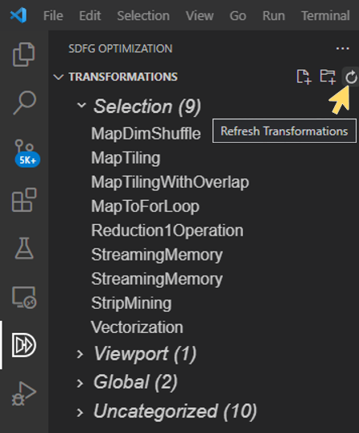

.. _installation:

Installation
============

DaCe is routinely tested on and officially supports Python 3.7 or newer (Python 3.6 is also supported, but not actively tested).

.. _dependencies:

Dependencies
------------

Most dependencies will be resolved when the package is installed with ``pip`` or ``setup.py``. Since DaCe compiles code,
however, it requires two more runtime dependencies to be installed and available in the ``PATH`` environment variable 
(if not, see :ref:`config` for how to configure different compiler paths):

 * A C++14-capable compiler (e.g., gcc 5.3+)
 * CMake 3.15 or newer. *Note: if CMake cannot be found or is too old, pip will try to install a version but it sometimes fails.*

**GPU**: For NVIDIA GPUs, the CUDA toolkit is also required, and AMD GPUs require HIP. :ref:`See more information on how to configure DaCe to use AMD GPUs <amd>`.
You may (optionally) want to install `CuPy <https://cupy.dev/>`_ for easy integration of GPU arrays in Python.

**FPGA**: Xilinx FPGAs require the Vitis suite and Intel FPGAs require the Intel FPGA SDK to be installed. 
DaCe has been tested with Intel FPGA SDK for OpenCL Pro edition v18.1 and v19.1, targeting Arria 10 and Stratix 10 devices, and Xilinx Vitis HLS v2020.x, v2021.x targeting u250 and u280 devices.

**Distributed Computing**: If using multiple nodes, MPI has to be installed and available.

Optional Dependencies
~~~~~~~~~~~~~~~~~~~~~

**CPU Performance Libraries**: If running on an Intel CPU, `MKL <https://software.intel.com/en-us/intel-mkl>`_ (or other
fast BLAS implementations for other platforms) is recommended. Install one and set the paths accordingly (see :ref:`troubleshooting`).
For MKL, it is possible to install with Anaconda Python via ``conda install mkl mkl-devel mkl-include``, and then manually
set the ``MKLROOT`` environment variable to the Anaconda environment.

**Einsum optimization**: The ``opt_einsum`` module can improve the behavior of ``numpy.einsum`` tensor operations.
DaCe natively supports this module, install with ``pip install opt_einsum``.

**Sparse arrays and scientific operations**: ``scipy`` provides sparse data structures (e.g., CSR matrices) and 
scientific operations (such as convolution). Install with ``pip install scipy``.

**MLIR support**: To use MLIR code directly in SDFGs, the ``pymlir`` module is necessary to parse the code. Install with
``pip install pymlir``.

Installing with ``pip``
-----------------------

.. note::
  If ``pip`` does not work, use ``python3 -m pip`` instead.

The easiest way to get started with DaCe is to install the latest release version:

.. code-block:: sh

  pip install dace

Installing the latest *development* version can be done by using the main branch directly (be warned that it may be unstable):

.. code-block:: sh

  pip install git+https://github.com/spcl/dace.git

.. _fromsource:

Installing for Development
--------------------------

For developing and extending DaCe, it is preferable to clone the git repository directly:

.. code-block:: sh

  git clone --recursive https://github.com/spcl/dace.git

Note the **recursive** flag; it is important to have all the submodules for DaCe to work!

Since DaCe is a pure Python library, nothing has to be built. The next step would be to install the dependencies and
the framework in ``editable`` mode, which makes the package available in your Python path:

.. code-block:: sh

  cd /path/to/cloned/dace
  pip install --editable .

**Testing**: To be able to run all the unit tests, some more packages are required. Install them by replacing ``.`` with ``.[testing]``.
Running all the tests can be done by calling ``pytest tests/`` on the DaCe folder. If you want to disable/enable some
tests, see the markers available with ``pytest --markers`` on the main folder.

.. _troubleshooting:

Troubleshooting
---------------

.. note::
  Can't find your issue? Look for similar `issues <https://github.com/spcl/dace/issues>`_ or start a discussion on `GitHub Discussions <https://github.com/spcl/dace/discussions>`_.

Common issues with the DaCe Python module
~~~~~~~~~~~~~~~~~~~~~~~~~~~~~~~~~~~~~~~~~

  * **Depedency errors**: If you are unable to install DaCe from ``pip`` due to a required dependency (most commonly CMake or ``scikit-build``
    on certain platforms), install CMake separately, make sure ``cmake`` is in your ``PATH`` environment variable, and
    try reinstalling DaCe.
  * **Missing includes/imports**: If you are using DaCe from the git repository (installed from source) and getting
    Python import errors or missing include files, make sure you cloned the repository recursively (with ``git clone --recursive``) and that the
    submodules are up to date.
  * **Mac OS**: If you are running on Mac OS and getting compilation errors when calling DaCe programs, make sure you have OpenMP
    installed and configured with Apple Clang. Otherwise, you can use GCC to compile the code by following these steps:

      * Run ``brew install gcc``
      * Set your ``~/.dace.conf`` compiler configuration to use the installed GCC. For example, if you installed 
        version 9 (``brew install gcc@9``), run ``which g++-9`` and set the configuration entry called :envvar:`compiler.cpu.executable`
        (empty string by default) to the resulting path
      * Remove any ``.dacecache`` folders to clear the cache

  * **Windows/Visual C++**: If compilation fails in the linkage phase, try setting the following environment
    variable to force Visual C++ to use Multi-Threaded linkage:

    .. code-block:: text

      X:\path\to\dace> set _CL_=/MT

  * **BLAS libraries**: When using fast BLAS operators (for example, matrix multiplication with Intel MKL), sometimes CMake cannot find the
    required include files or libraries on its own. If a library is installed but not found, add the include folders to
    the ``CPATH`` environment variable, and the library folders to the ``LIBRARY_PATH`` and ``LD_LIBRARY_PATH`` environment
    variables. If OpenBLAS is installed but not found, also ensure that ``libblas.so`` and ``liblapacke.so`` exist in the
    library folders as symbolic links pointing to ``libopenblas.so``.

  * **Bug in DaCe**: If you suspect an issue happens within DaCe, see :ref:`debugging` for ways to pinpoint the source
    of the issue.

  * **Intel FPGA libraries not found**: when targeting Intel FPGAs, the compilation process may fail due to missing OpenCL headers (CMake returns 
    a ``Could NOT find IntelFPGAOpenCL`` error). This is usually the case when Intel OpenCL compiler does not return the right path to OpenCL host headers. 
    DaCe relies on ``hlslib`` for compiling FPGA programs, which in turns relies on Intel's compiler to derive the right include path. Please verify that
    the include path returned by the Intel compiler (using the ``aocl compile-config`` command) points to a directory that actually contains the OpenCL headers (namely ``cl.hpp`` and
    ``cl2.hpp`` files). If this is not the case, please locate them under the Intel Quartus installation folder, and symlink (or copy) them in the ``aocl`` returned path.

.. _qa_vscode:

Common issues with the Visual Studio Code extension
~~~~~~~~~~~~~~~~~~~~~~~~~~~~~~~~~~~~~~~~~~~~~~~~~~~

Many of the issues with the extension can be explained by checking the SDFG Optimizer log. The SDFG Optimizer is a daemon
running Python in a Visual Studio Code terminal, and can be accessed using the following steps:

  * At the terminal pane (default: bottom right), choose the ``SDFG Optimizer`` tab
  * This reveals the optimizer daemon, which contains a log of the actions it was given
  * The last error can be found when scrolling up and finding Python exceptions

Common issues with the extension include:

  * **Daemon not loading**: If the extension keeps notifying that DaCe is not installed when the SDFG transformation
    pane is used, it may be a sign that the Visual Studio Code terminal is misconfigured. Check the SDFG Optimizer log
    (see above) and find the source of the issue. Common problems include:

    * The wrong Python interpreter (or virtual environment) was chosen in Visual Studio Code
    * Local networking issue (e.g., port not opening)
    * Missing dependency to run DaCe (see :ref:`dependencies`)

    You can directly rerun the daemon after locally fixing the issue by running the exact command again in the terminal
    (note that the randomized port number has to be the same for each session of Visual Studio Code).

  * **Transformations not showing up or referring to wrong nodes**: Hovering over the Transformations title in the
    SDFG Optimization pane reveals a Refresh button (see the image below). Try clicking that to force the optimizer to
    recompute which transformations apply. If the issue persists, switch tabs back and forth between other tabs
    and the SDFG.

|

  * **Error 500**: If a notification pops up with a "server error", the optimizer daemon has run into an unexpected
    exception. In this case, the SDFG optimizer log (see above) may offer more insights to the origin of the issue.
    If the issue has to do with a built-in feature, please `report an issue on the extension GitHub repository <https://github.com/spcl/dace-vscode/issues>`_.

  * **Reverting changes**: If you edited something and regret your decision (transformation, library node expansion, 
    properties etc.), try using the Undo/Redo buttons. The SDFG editor functions just like a text editor in Visual Studio Code. 

  * **Transformation responsiveness on large graphs**: When dealing with large SDFGs, transformation refreshing may take
    time. Look at the SDFG Optimizer log to see whether it is currently processing the transformations request

  * **Editor responsiveness**: If the editor seems stuck, close and reopen the SDFG editor tab. If the problem persists,
    the SDFG may be malformed. Load it in Python (see :ref:`format`) and call ``sdfg.validate()`` to get more 
    information about the issue and pinpoint the offending element.

